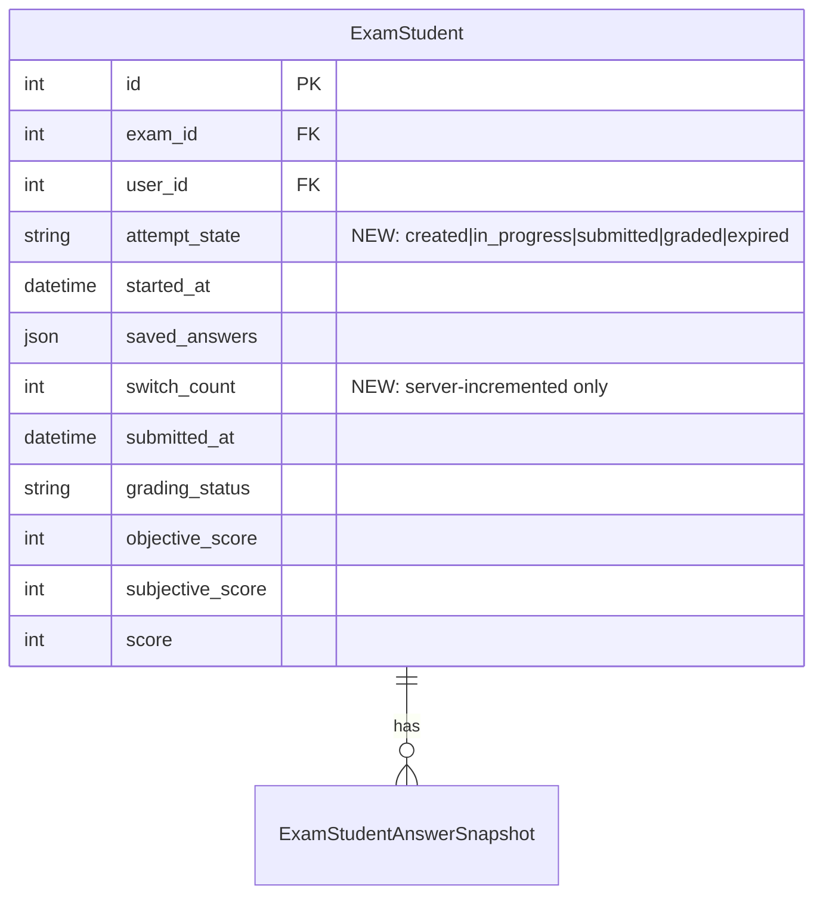

# Student Mobile Web — Design & Implementation

This document consolidates design specification and implementation plan into a single source of truth. The earlier separate spec at `docs/superpowers/specs/2026-05-13-mobile-pwa-design.md` has been merged in and removed.

## Enhancement Summary

**Deepened 2026-05-13** with 7 parallel research agents covering vite-plugin-pwa, vaul/bottom sheets, iOS PWA constraints 2026, network resilience patterns, KaTeX mobile performance, React 19 + Tailwind v4 patterns, and a focused migration review + deployment go/no-go.

### Critical corrections to original plan

1. **P0 migration bug fixed**: `grading_status` defaults to `'reviewed'` (`backend/src/app/exams/models.py:97`), so the original rule 5 (`grading_status='reviewed' → graded`) would have mis-labeled every brand-new and never-started attempt as `graded`. Rule 5 now requires `submitted_at IS NOT NULL`. See §1.1.
2. **Column renamed `state` → `attempt_state`**: avoids collision with `exams.status` and future `submission.state`. Generic `state` would foot-gun joins.
3. **Service worker bypass pattern corrected**: a `NetworkOnly` strategy on exam APIs still runs through Workbox. The only true bypass is a bare `return` in a custom `fetch` listener registered *before* Workbox's. See §3.2 — this was the single most important correction in the SW design.
4. **No `clientsClaim()`** in the service worker: it hot-swaps the controller mid-session and can break in-flight exam requests. See §3.6.
5. **`grading_status` semantic**: post-migration, `grading_status` is only meaningful when `attempt_state IN ('submitted','graded')`. Document as CHECK or convention.

### New findings worth adopting

- **Debounce alone is insufficient**: 2s debounce + 15s max-wait throttle (industry: TurboTax/Workday pattern). Replaces the existing 30s debounce.
- **Idempotency-Key (Stripe-style) is strictly better than status-check** if backend can be made to support it. Plan keeps status-check as the v1 path but flags the upgrade.
- **Module-level LRU cache for KaTeX** is a 10-minute change that cuts ~70% of render calls on long papers. Backend pre-render is the bigger ROI (separate plan).
- **Installed PWAs are EXEMPT from iOS 7-day eviction** — confirmed for 2026. Good news; the plan's 14-day localStorage TTL is conservative enough.
- **`useSyncExternalStore` is the React 19 canonical answer for `useMediaQuery`** — ~20 lines, no library dep. See §1.7.
- **Use `100svh` (not `100dvh`) on exam pages** — `dvh` causes layout shift mid-typing on iOS.
- **Skip virtualization for the 200-question map** — `react-virtuoso` not needed until >500 items, and it breaks Ctrl-F + screenshot.
- **`vaul@1.1.2` confirmed React 19 compatible**; shadcn/ui's Drawer already wraps it.
- **iOS in-app browsers** (WeChat, DingTalk, Line): detect UA, show "Open in Safari" banner. Never block; never assume storage persists.

### Anti-patterns now explicitly forbidden

- `clientsClaim()` in the service worker
- `registerType: 'autoUpdate'` on stateful pages
- `NetworkOnly` Workbox route for exam APIs (use bare-`return` bypass instead)
- Stacking two modal bottom sheets
- `position: fixed` action button on `<body>` for exam controls (must live inside sheet footer)
- `beforeunload` for final-save sweeps (kills bfcache; ~50% delivery on mobile)
- Polling `navigator.onLine` (use `online`/`offline` events + probe)
- Retrying 4xx responses
- Single global retry queue (head-of-line blocking)
- Component-level `useMemo` for shared LaTeX cache (use module-level LRU instead)

### Section-by-section enhancements landed

| Section | Change |
|---|---|
| §1.1 Backend state machine | Fixed P0 backfill bug, renamed column, full migration SQL skeleton inline, frozen `cutoff` pattern |
| §1.2 Sanitized DTO | Confirmed `sample_tests` MUST remain visible (code question requirement) |
| §1.7 Foundational hooks | `useSyncExternalStore` implementation, `svh` over `dvh` decision |
| §1.10 Exam-taking mobile | iOS swipe-back recipe (push two states), `vaul` sticky-header pattern |
| §1.13 Tailwind + deps | `vaul@1.1.2` pin, Sonner for toasts, `@theme` safe-area tokens |
| §3.2 Service worker | Bare-`return` bypass pattern with code |
| §3.5 Install entry | iOS instructions sheet recipe (no `beforeinstallprompt`) |
| §3.6 SW update flow | Removed `clientsClaim`, `setExamActive` ref pattern |
| §4 (new) Research-Derived Refinements | LaTeX cache, retry queue with AbortController, multi-tab BroadcastChannel, server-clock skew |
| §5 (new) Deployment Verification | Full SQL checklist, monitoring thresholds, 7 Go/No-Go gates |

---

## Overview

Mobile-web student experience for the exam system, delivered as a layered retrofit on the existing React/Vite SPA: backend security hardening + responsive student shell + minimal local draft buffer first; remaining page coverage and external candidate parity second; PWA installability and offline fallback last.

**Explicitly student-side only.** Teacher/admin mobile and full IndexedDB sync are out of scope and tracked separately.

## Context

The exam system is a React/Vite SPA with separate teacher and student route shells. Mobile users today share the same desktop-first layout, which produces horizontal overflow on exam list/result tables, hidden primary actions, exam-taking controls smaller than 44px, no offline resilience when the network drops mid-exam, and no installability.

The goal is a mobile experience that lets a student complete an exam end to end on a phone, with measured improvements in mobile completion rate and explicit handling of short network drops without compromising academic integrity.

## Goals

- Deliver a mobile-web student experience that covers all student routes used during an exam cycle: dashboard, exam list, exam taking, results, wrong answers, notifications, profile.
- Cover the public-link answer-taking flow for external candidates at the same mobile quality.
- Provide minimal in-exam resilience: a local per-question draft buffer that survives short network drops or page refresh after the exam has started.
- Define measurable success: mobile exam completion rate within Δ pp of desktop, mid-exam dropout rate, time-to-first-answer, and offline-recovery success rate.
- Add a PWA manifest and a minimal service worker for installability and a graceful offline fallback page, only after the responsive shell is shipping.

## Non-Goals

- **Teacher/admin mobile experience** — separate plan, contingent on observed teacher mobile usage.
- **Native iOS/Android/Flutter/RN app** — not in this plan, not on this roadmap.
- **Web Push or OS-level notifications** — not in this plan.
- **Full offline mode** — only the active exam page has draft resilience; everything else requires network.
- **Offline final submission** — submit always requires network; auto-submit on reconnect is best-effort and documented as such.
- **Service worker caching of exam API responses** — exam endpoints pass through the SW without interception.
- **External candidate IndexedDB / cross-session draft sync** — external candidates use the same minimal localStorage buffer as logged-in students; no cross-session reuse.

## Design Specification

This section captures the human-readable design decisions for each surface. The implementation phases below convert these into concrete tasks.

### Student Mobile Shell

The existing student layout switches by viewport. Desktop is unchanged. Mobile gets:

- Compact top bar with brand and one notification entry (single canonical home — removed from dashboard cards and Me tab).
- Bottom tab bar with **three tabs**: Home, Exams, Me.
- Exam-taking and result detail are full-screen routes that hide the bottom tab bar.

External candidate routes never enter the logged-in shell. They reuse the **answer-taking surface** with an identity-agnostic session principal abstraction (logged-in student or external_guest session). Tests assert that the same Playwright trace passes for both principals to prevent silent divergence.

### Dashboard (Home tab)

Content priority, top to bottom:

1. **Active exam banner** — only renders when a student has an in-progress attempt; deep-links into exam-taking.
2. **Next exam card** — earliest pending exam in the active window.
3. **Recent result** — last completed exam, score or "pending grading".
4. **Wrong Answers entry card** — count + most recent date.
5. **Compact metrics row** — at most 3 metrics, secondary visual weight.

State matrix per section: empty (first-time student), partial (some sections empty), loading skeleton, error retry.

### My Exams (Exams tab)

Two segmented tabs: **Pending/Ongoing** and **Completed**.

Mobile exam card: title, teacher, time window, duration, status, total questions, grading state, primary action. Ongoing attempts pinned first. Retake action visible only when allowed. All primary buttons ≥44px.

State matrix: empty (no exams assigned), all-completed, filter-empty, exam-window-not-open.

### Results

Single-column reading flow: summary score + grading status, per-question score + status, student answer, correct answer (gated by `Exam.show_result`), explanation, teacher comments. Pending-AI and reviewed states show distinct labels.

State matrix: pending-grading skeleton, partially graded (objective only), grading-failed retry, no-attempt-yet.

### Wrong Answers

Single-column on mobile. Preserve `to review` and `mastered` tabs. Card: question type, title preview, exam title, last wrong date, wrong count, tags, mastered status. Detail: readable single column with question, answer, explanation, mastery action.

State matrix: no wrong answers yet (first-time onboarding), all mastered (celebratory), per-tab empty.

### Notifications

In-app only. Bottom sheet from the top-bar entry. Red dot when unread > 0, count badge for ≤9, "9+" otherwise. **No Web Push, no OS notification.** Notifications during active exam are silent — no auto-pop, only red dot updates.

### Me (profile sheet)

Single sheet, not a tab content surface:

- Profile row.
- Theme toggle.
- Language toggle.
- Install entry (deferred prompt on Android/Chromium; static "Add to Home Screen" instructional sheet on iOS; hidden when already installed or unsupported).
- Logout.

### Exam-Taking Experience

The exam page is the highest-risk surface. Treated as an immersive route — no bottom tab bar.

**Layout:**

- **Top bar** (fixed): back action (protected), exam title, **countdown** (always full text — title truncates first on 320px), save-state label, `pt-safe-t`.
- **Main**: single-question mode by default. Show-all toggle hidden on mobile in v1.
- **Bottom action bar** (fixed, `pb-safe-b`): Previous, Question Map, Next, Submit. Tap targets ≥44px, never overlap iOS home indicator.
- **Question map drawer** (bottom sheet, `vaul`): for ≥60 questions, groups by section with sticky headers and "Jump to first unanswered" affordance. Cells color-coded by state. No virtualization until >500 items.
- **Submit confirmation** (bottom sheet, `vaul` with `dismissible={false}`): lists unanswered count, pending-sync count, network status. When offline, Submit is **disabled** with explanation copy, never silently fails.

Top-bar content priority on 320px screens: countdown > save-state > title (truncates) > back action (always present).

**Save State Label (four states):** Saved on this device / Syncing / Synced / Pending sync (N).

Placement: in the top bar, right of the countdown.

Behavior rules:
- "Syncing" only appears when the sync takes >400ms (debounced to avoid flashing on keystrokes).
- "Synced" auto-fades to "Saved on this device" after 2s.
- "Pending sync (N)" persists with manual retry affordance.
- Visually subtle (`text-xs`, muted) — never competes with the countdown.

**Protected back navigation:** during an active exam, the top-bar back action and the browser back button both trigger an `AlertDialog` confirming exit. On iOS, push **two** dummy `history.pushState` entries (WebKit bug #248303 workaround). Never `window.confirm`.

**Question types** — all six supported: choice, true/false, fill-in, short answer, essay, code. Code questions on mobile use the existing Monaco editor in read-friendly mode (line wrap on, smaller font, no minimap, suggestions hidden). 44px rule scoped to app-shell controls; Monaco's internal widgets exempt. For genuinely complex coding tasks, render a "Best experienced on desktop" hint but keep the answer editable and submittable.

**Time and anti-switch rules (mobile-specific):**

- Switch-count increments only on visibility transitions where the page has been hidden ≥3 seconds. Transient interrupts (notification banner, control center pull, brief lockscreen glance) do not count.
- `switch_count` is **server-authoritative** — the client posts visibility events; the server applies the threshold and stores the count. Client cannot decrement or reset.
- Warnings render above the bottom action bar with full-screen-readable size, never hidden behind fixed chrome.
- Time-up and switch-limit countdowns clearly state whether the app is submitting or waiting for network.

### Local Draft Resilience

A minimal client-side buffer keeps in-progress answers safe across short network drops or accidental refresh.

**Storage:** `localStorage` only. One namespaced key per active attempt:

```
exam-draft:<session_principal_id>:<attempt_id>
```

Value: `{ answers: Record<question_id, answer_content>, last_local_save_ms: number }`. No per-answer timestamps. No conflict-resolution metadata. **No exam snapshot stored locally** — questions are re-fetched from server on every mount (security mandate, see below).

**Lifecycle:**

- **Start**: on successful `/api/student/exams/:id/start`, render purely from server. If a stale local draft exists and the server response has no answer where local does, surface a "recovered answers — review before sync" banner (never auto-applied).
- **Edit**: every change writes to `localStorage` immediately, then triggers the existing per-question save with debounce + retry queue.
- **Refresh/reopen mid-exam**: `/start` is authoritative; local draft answers not on the server are surfaced for review.
- **Submit**: flush pending retries, POST `/submit` with the full payload; on ambiguous failure, GET `/attempt-status` before retry.
- **Cleanup**: on successful submit, on logout, on candidate session invalidation, or after 14 days idle.

**What the design explicitly does NOT try to do:**

- No client-clock based conflict resolution — server is sole authority.
- No background submission after the tab closes — auto-submit on reconnect is best-effort, tab-open only.
- No localStorage recovery from a different account on a shared device — login purges other principals' keys.
- No offline submission — submit requires network, full stop.

### Security Requirements (non-negotiable mandates)

Plan-level mandates that implementation cannot defer. The implementation phases §1.1–§1.6 below operationalize each one.

**Snapshot DTO.** No client-stored exam snapshot. Question content fetched fresh from `/api/student/exams/:id/start`. The student-facing response DTO must explicitly exclude:
- `correct_answer`, `correct_answers`, `correct_option_ids`
- `explanation`, `solution`, `reference_answer`, `analysis`
- `rubric`, `scoring_rubric`, `score_per_question_max` if it leaks rubric weight
- `hidden_test_cases` for code questions
- Any field used during grading

A schema test asserts the student response has none of these. The backend serves a sanitized model distinct from the teacher/grading response model.

**Server authority.**
- **Attempt state machine** (server-enforced): `created → in_progress → submitted → graded` or `→ expired`. Save and submit endpoints reject any write whose attempt is not `in_progress`.
- **Deadline**: server compares `server_clock_now()` to `attempt.deadline`. Late submits rejected regardless of client-reported timestamps.
- **Submission idempotency**: second `/submit` on a `submitted` attempt returns the existing submission (200), not 4xx, so clients can safely retry after ambiguous network failures. Client first checks status via GET before retry.
- **Per-answer ordering**: server applies last-write-wins by request arrival order. No client-supplied timestamp influences ordering.

**Visibility / switch-count.** Client-side visibility detection is best-effort UX. The server is the source of truth: the client posts visibility events; the server applies the ≥3s threshold and increments the count; client cannot manipulate it.

**Storage hygiene.**
- On login, purge all `exam-draft:*` keys whose principal id does not match the current authenticated identity.
- On logout, remove all `exam-draft:*` keys.
- On entry of a new external candidate session, prior candidate-namespaced keys are removed.
- Candidate identity used for namespacing is a server-issued opaque session id (the `external_guest` User.id), never the raw invitation token.

**Service worker integrity.**
- Served over HTTPS with HSTS. Mandatory.
- SW scope is the app root; SW must not register a `fetch` handler for exam API paths (cannot intercept them even if poisoned).
- Cache version bumps on logout.
- Update activation suppressed while `/student/exams/:id/take` is mounted.

### Error Handling (UX states with copy)

Required states, each with explicit copy and a defined action:

- **Offline while browsing non-exam pages**: SW fallback page with retry button.
- **Offline during active exam**: top-bar save-state shows "Pending sync (N)" with retry; banner above the bottom action bar: "Your answers are saved on this device. Submit requires network."
- **Submit attempted offline**: Submit button disabled in the confirmation sheet, with the same banner copy.
- **Sync failure**: per-question pending-sync badge; auto-retry on `online` event; manual retry available.
- **Refresh during exam**: `/start` is authoritative; local-only answers surfaced as recovery banner, never silently applied.
- **`localStorage` unavailable** (Safari Private / Lockdown): detected on attempt start. Student sees "Your browser is blocking local storage. Answers will only be saved when the network is available — do not leave this page." with "Continue" / "Switch browser" choice. Per-question save uses zero debounce in this mode.
- **External candidate token invalid**: return to invitation entry; no student shell ever renders.
- **`/submit` ambiguous failure**: GET status before retry; treat `submitted` as success.

### Cut Line (if scope must shrink mid-implementation)

If timeline pressure forces a cut, drop in this order:

1. Phase 3 PWA foundation — student mobile still works without installability.
2. External candidate answer-taking parity beyond layout fixes.
3. Wrong Answers detail polish (list works without mastery flow).

The exam-taking surface and local draft buffer are **non-negotiable** — they are the entire reason this work exists.

### Open Design Questions

Not blockers for plan approval; decided during Phase 1 implementation:

1. Exact `Δ pp` value and instrumentation source for the mobile completion-rate success metric.
2. Whether "recovered answers — review before sync" requires explicit per-answer confirmation, or auto-syncs after a single banner-level confirmation.
3. Whether iOS WeChat / DingTalk / Line in-app browsers are a graceful-degrade target or a non-target. Affects install entry copy and the degradation banner.
4. Switch-count threshold value for the new mobile policy. Plan default: 3s hide. Final value depends on real-device telemetry.
5. Whether to add a server-side time-up auto-submit cron for the "offline tab closed at deadline" gap (currently tracked as future work).

## Proposed Solution

Three sequential phases, **mobile UX first, infrastructure last** (the riskiest, highest-value work is the exam page on a phone — it ships first, not last):

1. **Phase 1** — Backend security hardening (attempt state machine, sanitized question DTO, server-authoritative switch-count, idempotent submit) + responsive student shell + mobile exam-taking + local draft buffer. Highest risk, highest value, ships first.
2. **Phase 2** — Mobile coverage for remaining student pages (result, wrong answers, notifications, profile) + external candidate answer-taking parity.
3. **Phase 3** — `vite-plugin-pwa` (injectManifest), manifest, icons, install entry, offline fallback page, SW exclusion for exam APIs.

Each phase ships independently behind viewport checks — desktop behavior is preserved untouched.

## Technical Approach

### Architecture

#### Frontend layout split

The existing `student-layout.tsx` mixes desktop nav into a single component. The retrofit introduces a `useViewport` hook and branches at the shell level — desktop renders the existing layout unchanged; mobile renders a new app shell.

```
frontend/src/components/
  student-layout.tsx              [MODIFY — branches on useViewport]
  student-layout-desktop.tsx      [NEW — extracted from current student-layout.tsx]
  student-layout-mobile.tsx       [NEW — top bar + bottom tab + safe-area]
  mobile/
    bottom-tab-bar.tsx            [NEW]
    mobile-top-bar.tsx            [NEW]
    notification-sheet.tsx        [NEW]
    install-entry.tsx             [NEW — Android prompt + iOS instructions]
    save-state-label.tsx          [NEW — debounced label]
    offline-banner.tsx            [NEW]
    question-map-drawer.tsx       [NEW — bottom sheet, long-exam aware]
    submit-confirm-sheet.tsx      [NEW]

frontend/src/hooks/
  use-viewport.ts                 [NEW — single source of truth for mobile/desktop]
  use-connectivity.ts             [NEW — online/offline with reconnect debounce]
  use-exam-draft.ts               [NEW — wraps lib/exam-draft, ties to attempt lifecycle]
  use-visibility-detection.ts     [MODIFY — ≥3s threshold + event-stream client]
  use-exam-taking.ts              [MODIFY — wires draft buffer + retry queue]

frontend/src/lib/
  exam-draft.ts                   [NEW — localStorage envelope, namespacing, purge]
  api.ts                          [MODIFY — retry queue + idempotent submit retry]

frontend/src/providers/
  auth-provider.ts                [MODIFY — preserve exam-draft:* keys on 401; redirect carefully during active exam]
```

#### Backend hardening

The §Security Requirements mandates land as concrete changes:

```
backend/src/app/exams/
  models.py                       [MODIFY — add ExamAttemptState enum + state column on ExamStudent]
  student_router.py               [MODIFY — state-machine guard, deadline enforcement, idempotent submit, visibility-events endpoint]
  student_schemas.py              [MODIFY — sanitized StudentQuestionPayload + new schemas]
  question_sanitizer.py           [NEW — strips correct_answer/analysis/explanation/hidden_test_cases]
  invitation_router.py            [MODIFY — RedeemResponse already returns user.id which is opaque; document this satisfies spec, no new session table needed]

backend/alembic/versions/
  20260513_add_exam_attempt_state.py    [NEW migration — add state column + backfill]

backend/tests/
  test_student_question_sanitizer.py    [NEW — assert blocklisted keys absent]
  test_student_attempt_state.py         [NEW — state-machine transitions]
  test_student_submit_idempotency.py    [NEW — second submit returns first response]
  test_student_visibility_events.py     [NEW — ≥3s threshold + server-authoritative count]
```

#### Data model change



**Column name is `attempt_state`** (not `state`) to avoid collision with `exams.status` and future `submission.state`.

The `attempt_state` column is added with a server-side backfill. **Critical correction from initial draft:** `grading_status` has a default of `'reviewed'` (`models.py:97, 121`), so a rule keyed only on `grading_status='reviewed'` would mis-label every brand-new attempt as `graded`. Every rule below conditions on `submitted_at` too. Rules are **evaluated in order** — later UPDATE statements overwrite earlier ones where conditions overlap:

| Order | Condition (against frozen `cutoff`) | `attempt_state` |
|---|---|---|
| 1 | `started_at IS NULL AND submitted_at IS NULL` | `created` |
| 2 | `started_at IS NOT NULL AND submitted_at IS NULL AND exam.end_time > cutoff` | `in_progress` |
| 3 | `started_at IS NOT NULL AND submitted_at IS NULL AND exam.end_time <= cutoff` | `expired` |
| 4 | `submitted_at IS NOT NULL AND grading_status <> 'reviewed'` | `submitted` |
| 5 | `submitted_at IS NOT NULL AND grading_status = 'reviewed'` | `graded` |

Anomalies to count and decide policy for **before** running:
- `started_at IS NULL AND submitted_at IS NOT NULL` — legacy force-submit path (rare; falls through to `created` above, which is wrong). Manually fix or add a rule 0.
- `latest_submission_id IS NOT NULL AND submitted_at IS NULL` — data inconsistency. Investigate.

Run pre-deploy query C in §5 to confirm zero unclassifiable rows.

### Migration SQL skeleton (corrected)

```python
revision = "20260513_add_exam_attempt_state"
down_revision = "20260512_add_must_change_password_to_users"

ATTEMPT_STATES = ("created", "in_progress", "expired", "submitted", "graded")

def upgrade() -> None:
    op.execute(f"CREATE TYPE exam_attempt_state AS ENUM {ATTEMPT_STATES!r}")
    op.add_column("exam_students", sa.Column(
        "attempt_state",
        sa.Enum(*ATTEMPT_STATES, name="exam_attempt_state", create_type=False),
        nullable=True,                  # nullable first, tighten after backfill
        server_default="created",
    ))
    op.execute("""
        DO $$
        DECLARE cutoff timestamptz := now();
        BEGIN
            UPDATE exam_students SET attempt_state = 'created'
              WHERE attempt_state IS NULL
                AND started_at IS NULL
                AND submitted_at IS NULL;

            UPDATE exam_students es SET attempt_state = 'in_progress'
              FROM exams e
              WHERE es.exam_id = e.id
                AND es.attempt_state IS NULL
                AND es.started_at IS NOT NULL
                AND es.submitted_at IS NULL
                AND e.end_time > cutoff;

            UPDATE exam_students es SET attempt_state = 'expired'
              FROM exams e
              WHERE es.exam_id = e.id
                AND es.attempt_state IS NULL
                AND es.started_at IS NOT NULL
                AND es.submitted_at IS NULL
                AND e.end_time <= cutoff;

            UPDATE exam_students SET attempt_state = 'submitted'
              WHERE attempt_state IS NULL
                AND submitted_at IS NOT NULL
                AND grading_status <> 'reviewed';

            UPDATE exam_students SET attempt_state = 'graded'
              WHERE attempt_state IS NULL
                AND submitted_at IS NOT NULL
                AND grading_status = 'reviewed';
        END $$;
    """)
    op.alter_column("exam_students", "attempt_state", nullable=False)
    op.create_index(
        "ix_exam_students_student_attempt_state",
        "exam_students", ["student_id", "attempt_state"],
    )

def downgrade() -> None:
    op.drop_index("ix_exam_students_student_attempt_state", "exam_students")
    op.drop_column("exam_students", "attempt_state")
    op.execute("DROP TYPE exam_attempt_state")
```

Notes:
- `cutoff := now()` is frozen once per migration run so re-runs are idempotent and chunk boundaries don't drift.
- `WHERE attempt_state IS NULL` guard on every UPDATE means re-running upgrade is a no-op and a live student writing during migration races back to runtime code as authority (not a backfill overwrite).
- Index `(student_id, attempt_state)` supports the mobile exam-list query that filters by `attempt_state IN ('created','in_progress')` per student.
- For `exam_students` row counts >1M, split the UPDATEs into chunked transactions by PK to keep lock duration bounded. Current scale appears <1M; single-statement is fine.

#### Local draft buffer envelope (frontend)

Adopt the existing `lib/exam-seed.ts` envelope pattern (timestamped, namespaced, purge-on-stale). Key format:

```
exam-draft:<principal_id>:<attempt_id>
{ answers: Record<question_id, answer_content>, last_local_save_ms: number, attempt_id: number, principal_id: string }
```

The principal id is the logged-in user id (for logged-in students) or the `external_guest` user id returned by `/api/exam-invite/redeem` (already opaque, server-issued, distinct from the invitation token — research confirmed this satisfies spec §Storage Hygiene without a new session table).

### Implementation Phases

---

#### Phase 1: Backend hardening + Mobile shell + Exam taking + Local drafts

**Goal:** A student can complete an exam on a phone, with the buffer surviving a 5-minute offline window and a refresh, and zero spec-level security gaps server-side.

##### 1.1 Backend — attempt state machine

- [ ] Add `ExamAttemptState` enum in `backend/src/app/exams/models.py` with values `{created, in_progress, submitted, graded, expired}`.
- [ ] Add `state` column to `ExamStudent` (default `created`, server_default for migration).
- [ ] Write Alembic migration `20260513_add_exam_attempt_state.py` following the pattern in `backend/alembic/versions/add_student_exam_runtime.py:20-25`. Include the backfill SQL above.
- [ ] Replace `_ensure_exam_attempt_in_progress` at `backend/src/app/exams/student_router.py:596` with a state-machine guard that:
  - Loads attempt state
  - Rejects if not `in_progress` for save / switch / submit
  - Transitions `in_progress → submitted` on first successful submit
  - Transitions `submitted → graded` from grading worker (existing `grading/service.py:490-497` audit pattern)
  - Transitions `in_progress → expired` lazily on any read when `exam.end_time < now()`
- [ ] Add audit log entry on each state transition. Mirror the `GradingAuditEvent` shape (`backend/src/app/grading/models.py:269`).
- [ ] Add `BackgroundTasks` job (or periodic worker) that sweeps `in_progress` attempts past `end_time` and marks them `expired` — so the state stays accurate without read-time reliance.

##### 1.2 Backend — sanitized question DTO

- [ ] Create `backend/src/app/exams/question_sanitizer.py` exporting `sanitize_question_content(content: dict) -> dict` and `sanitize_question_options(options: list) -> list`. Strip:
  - From `content`: `correct_answer`, `correct_options`, `correct_option_ids`, `explanation`, `analysis`, `solution`, `reference_answer`, `rubric`, `hidden_test_cases`
  - From each option: `is_correct`, `explanation`, `score_weight`
  - **Keep `sample_tests`** — these are the visible example test cases shown to students for code questions; over-stripping would break code question UX. Distinct from `hidden_test_cases` (which is stripped). Sanitizer test must include a `sample_tests`-bearing fixture asserting it remains present.
- [ ] Wire sanitizer into `student_router.py:699-710` where `StudentQuestionPayload` is built.
- [ ] Write `backend/tests/test_student_question_sanitizer.py` that:
  - Seeds a Question with every blocklisted field set
  - Calls the sanitizer
  - Asserts each blocklisted key is absent from the result
  - Asserts kept keys (title, options text, score, type, sample_tests) remain
- [ ] Add a parallel test that hits `/api/student/exams/:id/start` end-to-end and asserts no blocklisted key appears in the response JSON.

##### 1.3 Backend — server-side deadline enforcement

- [ ] In `save_answers` (`student_router.py:787`), reject with 410 Gone (or 403, pick one consistently) when `exam.end_time < now()`. Error body explains "exam window closed".
- [ ] In `submit_exam` (`student_router.py:824`), reject when state is `expired`. The lazy-expire sweep in 1.1 ensures this fires consistently.
- [ ] Document that server clock is the only authority; client-supplied timestamps (which the API does not accept anyway) cannot influence ordering.

##### 1.4 Backend — idempotent submit + attempt-status endpoint

- [ ] Change `submit_exam` at `student_router.py:833-834` from `HTTPException(400)` on already-submitted to returning the existing `SubmitExamResponse` with status 200. The handler already has `latest_submission_id` (`models.py:94`) — return the cached submission record's response shape.
- [ ] Add `GET /api/student/exams/{exam_id}/attempt-status` returning `{state, submitted_at, latest_submission_id, switch_count, deadline_at}`. Client uses this before retrying an ambiguous submit.
- [ ] Update `backend/tests/test_student_submit_after_end.py` — that test currently asserts submits after `end_time` succeed; per spec they must now fail. Coordinate with QA: this is a behavior change.
- [ ] Add `test_student_submit_idempotency.py` covering: first submit returns 200, second submit returns 200 with the same submission id.

##### 1.5 Backend — server-authoritative switch-count

- [ ] Add `POST /api/student/exams/{exam_id}/visibility-events` accepting `{events: [{hidden: bool, at_ms: number}]}`. Server logic:
  - Reduce into "hide periods" (matched hide → show pairs)
  - Increment `switch_count` for each period whose duration is `≥3000 ms`
  - Return `{switch_count, max_switch_count}` so client can render warnings
- [ ] Keep `POST /api/student/exams/{exam_id}/switch` (`student_router.py:807-821`) but **ignore `payload.switch_count`** — it becomes a no-op endpoint for backwards compatibility with existing desktop clients until they migrate. Add a deprecation log.
- [ ] Rate-limit visibility-events to 10 req/sec per attempt to prevent abuse.
- [ ] Test: 5 hide/show toggles within 1s → 0 increments; 1 hide of 5s → 1 increment; 2 hides of 5s each → 2 increments.

##### 1.6 Backend — external candidate session id (clarification)

Origin spec mandates "server-issued opaque session id, never the raw invitation token". Research confirms the existing flow already issues one: `invitation_router.py:168-191` creates an `external_guest` `User` row whose `id` is the JWT `sub` and is distinct from the invitation token. The localStorage namespace uses that user id.

- [ ] No new model needed. Document the equivalence in `RedeemResponse` schema docstring (`invitation_schemas.py:35-38`).
- [ ] Add a test asserting the invitation token does not appear in `RedeemResponse.access_token`'s decoded payload as a plaintext field, and the token cache is hashed (`invitation_models.py:12-50` already stores `token_hash`).

##### 1.7 Frontend — foundational hooks and libs

- [ ] `frontend/src/hooks/use-viewport.ts` — built on **`useSyncExternalStore`** (React 19 canonical pattern for browser-only state). ~20 lines, no library dep, no one-frame flash. SSR-safe `getServerSnapshot`. Setup-test in `frontend/src/test/setup.ts` already mocks `matchMedia`.
  ```ts
  // frontend/src/hooks/use-viewport.ts
  import { useSyncExternalStore } from "react";
  const subscribe = (q: string) => (cb: () => void) => {
    const mql = window.matchMedia(q);
    mql.addEventListener("change", cb);
    return () => mql.removeEventListener("change", cb);
  };
  export function useMediaQuery(query: string, ssrDefault = false): boolean {
    return useSyncExternalStore(
      subscribe(query),
      () => window.matchMedia(query).matches,
      () => ssrDefault,
    );
  }
  export const useIsMobile = () => useMediaQuery("(max-width: 767px)", false);
  ```
- [ ] **Viewport unit choice**: use `100svh` (small viewport height) on exam pages, never `100dvh`. `dvh` causes layout shift mid-typing on iOS as the chrome bars animate. `svh`/`lvh`/`dvh` reached Baseline Widely Available June 2025; ~95% support. Provide a `@supports` fallback to `100vh` for any laggard browsers.
- [ ] `frontend/src/hooks/use-connectivity.ts` — wraps `navigator.onLine` + `online`/`offline` events with a 2s debounce on reconnect (avoids flicker on flaky networks). Returns `{ online: boolean, lastChangedAt: number }`.
- [ ] `frontend/src/lib/exam-draft.ts` — modeled on `frontend/src/lib/exam-seed.ts`:
  - `setDraft(principalId, attemptId, answers)` — writes to `localStorage['exam-draft:<pid>:<aid>']`
  - `getDraft(principalId, attemptId)` — reads, returns null if missing/stale
  - `clearDraft(principalId, attemptId)` — explicit removal
  - `purgeForPrincipal(principalId)` — clear all keys for a principal
  - `purgeAllExcept(principalId)` — used on login to wipe other users' keys
  - `purgeAll()` — used on logout
  - All writes wrapped in `try/catch` for `QuotaExceededError`; fall back to in-memory map with a one-time `console.warn`
- [ ] `frontend/src/hooks/use-exam-draft.ts` — wraps `lib/exam-draft.ts` into a React-friendly hook tied to the active attempt lifecycle.

##### 1.8 Frontend — auth-provider draft-key preservation

Research surfaced that `frontend/src/providers/auth-provider.ts` and `frontend/src/lib/session-expiry.ts` call a `redirectToLogin` that clears all of localStorage on 401, which would wipe draft answers mid-exam.

- [ ] Modify `redirectToLogin` to remove only the known auth keys (`access_token`, `user`, etc.) explicitly, never `localStorage.clear()` and never any key matching `exam-draft:*`.
- [ ] On the exam-taking route specifically, intercept 401 from `/answers`, `/switch`, `/visibility-events` (not `/start`, not `/submit`): show a re-auth modal that lets the user enter password without leaving the page. Token refresh on success, draft preserved.
- [ ] On `/start` 401 or `/submit` 401: redirect to login is acceptable, but the draft must remain in localStorage for restoration after re-login.

##### 1.9 Frontend — visibility detection migration

- [ ] Modify `frontend/src/hooks/use-visibility-detection.ts`:
  - Record `{ hidden: true, at_ms: Date.now() }` on `visibilitychange` → hidden
  - Record `{ hidden: false, at_ms: Date.now() }` on visible
  - Batch events into a 1s flush window
  - POST to `/api/student/exams/:id/visibility-events`
  - On response, update local `switch_count` from server (server is authority)
  - Use server-returned count for the existing `onMaxReached` callback
- [ ] Keep desktop behavior unchanged — same hook, same threshold (server applies ≥3s regardless of client viewport).
- [ ] Replace the existing `reportSwitch` call in `use-exam-taking.ts:134-142` with the new endpoint.

##### 1.10 Frontend — exam-taking mobile branch

The current `exam-taking.tsx` is 708 lines with scattered `sm:`/`md:` branches. Extract not duplicate:

- [ ] Refactor `exam-taking.tsx` into:
  - `exam-taking.tsx` — orchestrates `use-exam-taking`, decides via `useViewport` which renderer to mount
  - `exam-taking-desktop.tsx` — current rendering verbatim, no behavior change
  - `exam-taking-mobile.tsx` — new mobile rendering using the components below
- [ ] `mobile/exam-top-bar.tsx` — fixed top, content priority order: back action (always), countdown (always full text), save state label (truncate first), title (truncate last). Uses `env(safe-area-inset-top)`.
- [ ] `mobile/exam-bottom-bar.tsx` — fixed bottom, four targets (Previous, Question Map, Next, Submit), all ≥44px, `env(safe-area-inset-bottom)`.
- [ ] `mobile/question-map-drawer.tsx` — uses `vaul` for bottom sheet. For ≥60 questions, groups by section with sticky headers + "Jump to first unanswered". Cells color-coded by state.
- [ ] `mobile/submit-confirm-sheet.tsx` — bottom sheet content: unanswered count, pending-sync count, network status. Submit button disabled when `useConnectivity().online === false`.
- [ ] `mobile/save-state-label.tsx`:
  - State: `saved-local | syncing | synced | pending-sync(count)`
  - "Syncing" appears only if pending sync > 400ms (debounced)
  - "Synced" auto-fades to "Saved on this device" after 2s
  - "Pending sync" persistent with manual retry button
  - Subtle styling (`text-xs`, muted) — never competes with countdown
- [ ] Hide show-all toggle on mobile (currently in `use-exam-taking.ts`).
- [ ] Protected back navigation: **iOS-specific recipe** — `history.pushState` outside of a user gesture creates no real history entry on iOS Safari (WebKit bug #248303). Inside the route's `useEffect` mount, push **two** dummy states (`history.pushState({guard:1},'')` twice) within a microtask. On `popstate`, show `AlertDialog` confirming exit; on confirm → `history.go(-2)`; on cancel → push another guard state. Test on real device — iOS simulator does not reproduce the bug. Reuse existing `alert-dialog.tsx` (memory rule: no `window.confirm`).
- [ ] Question map drawer (`mobile/question-map-drawer.tsx`) — **do not virtualize** until the exam exceeds 500 questions. For 60–500 questions, a plain CSS grid renders in <16ms and preserves Ctrl-F / screenshot / scroll-restore. Use sticky section headers and a "Jump to first unanswered" anchor button.

##### 1.11 Frontend — refresh-recovery flow

When `exam-taking.tsx` mounts and a `getDraft` returns answers:

- [ ] Call `/start` first — render purely from server response.
- [ ] Diff server `saved_answers` vs local draft answers.
- [ ] If local has answers for questions where server has none (or where local content differs), show a banner: "We found N answers saved on this device that haven't synced yet. [Review] [Apply all]".
- [ ] Review opens a sheet listing each diverged question with both values and a per-row apply/discard.
- [ ] Apply all posts each as `/answers`; on success, clear from local; on failure, remain in retry queue.
- [ ] No auto-apply — recovered answers always require an explicit user action.

##### 1.12 Frontend — dashboard and exam list mobile

- [ ] Mobile dashboard (`frontend/src/pages/student/dashboard.tsx`):
  - Branch on `useViewport`
  - Mobile order: active exam banner → next exam card → recent result → wrong answers entry → compact metrics row (max 3)
  - Each section has explicit empty / loading / error states (test matrix below)
- [ ] Mobile exam list (`frontend/src/pages/student/my-exams.tsx`):
  - Same component, mobile branch renders cards instead of table
  - Segmented tabs `Pending/Ongoing` and `Completed` preserved
  - Ongoing attempts pinned first; primary button ≥44px

##### 1.13 Frontend — Tailwind + dependencies

- [ ] Tailwind v4 defaults work (`md:` = 768px, matches `useViewport`). Stay mobile-first (default unprefixed = mobile).
- [ ] Add **`vaul@^1.1.2`** (confirmed React 19 compatible; shadcn/ui's Drawer already wraps it). No new bundle chunks — small enough to keep in default vendor.
- [ ] Add **`sonner`** for non-modal toasts (notification banners, save-state retry hints). Rendered in a sibling Portal above any active sheet — never stack two modal sheets; toasts/banners must be non-modal.
- [ ] Define safe-area tokens via Tailwind v4 `@theme`:
  ```css
  /* frontend/src/styles/safe-area.css */
  @theme {
    --spacing-safe-t: env(safe-area-inset-top);
    --spacing-safe-b: env(safe-area-inset-bottom);
  }
  ```
  Then use `pt-safe-t` / `pb-safe-b` on the top bar / bottom action bar. Also ensure `<meta viewport ... viewport-fit=cover>`.
- [ ] Canonical sheet wrapper pattern (use across submit-confirm, question map, notifications, profile): vaul `Drawer` with `dismissible={false}` for destructive confirms (submit), `dismissible={true}` for browsable lists. Sticky header + scrollable body via flex column. `repositionInputs` (default true) handles iOS keyboard for text inputs inside sheets.
- [ ] Apply `overscroll-behavior-y: none` on `<html>` and `<body>` to kill iOS pull-to-refresh during exam. On sheet scroll containers: `overscroll-behavior: contain; touch-action: pan-y`.
- [ ] **Do NOT** apply `position: fixed` to `<body>` (vaul auto-locks body scroll; double-lock breaks input focus).

##### 1.14 Phase 1 tests

Backend (pytest):
- [ ] `test_student_attempt_state.py` — transitions, expired rejection
- [ ] `test_student_question_sanitizer.py` — all blocklisted keys absent
- [ ] `test_student_submit_idempotency.py` — second submit returns 200
- [ ] `test_student_visibility_events.py` — ≥3s threshold, server-authoritative count
- [ ] Update existing `test_student_submit_after_end.py` to reflect new "submit after end is rejected" behavior
- [ ] `test_student_attempt_status_endpoint.py` — new GET returns correct shape

Frontend (vitest):
- [ ] `lib/exam-draft.test.ts` — namespacing, purge, quota fallback
- [ ] `hooks/use-connectivity.test.ts` — debounce, edge cases
- [ ] `hooks/use-viewport.test.ts` — matchMedia mocks
- [ ] `mobile/save-state-label.test.tsx` — debounce, auto-fade

E2E (Playwright):
- [ ] Add mobile project to `frontend/playwright.config.ts`: `{ name: 'Mobile Chrome', use: { ...devices['Pixel 5'] } }`, `{ name: 'Mobile Safari', use: { ...devices['iPhone 13'] } }`.
- [ ] `src/test/e2e/student-mobile-exam.spec.ts`:
  1. Login → dashboard → start exam → answer mix → simulate offline (`context.setOffline(true)`) → continue answering → reconnect → see "Synced" → submit → result
  2. Refresh during exam → see recovery banner → apply all → continue → submit
  3. Submit while offline → button disabled, banner explains

##### 1.15 Phase 1 acceptance

- Student can complete an exam on Pixel 5 + iPhone 13 viewports with no horizontal overflow.
- Submit attempted while offline is blocked with copy.
- Server returns sanitized question DTO (verified by schema test + e2e response inspection).
- Second submit returns 200, not 400.
- Switch count is server-incremented only; tampering localStorage cannot affect it.
- Visibility transitions <3s do not increment.

---

#### Phase 2: Remaining student pages + External candidate parity

##### 2.1 Result page mobile

- [ ] `exam-result.tsx` mobile branch:
  - Single column reading flow
  - Summary score + grading status
  - Per-question card: score, status, student answer, correct answer (gated by `Exam.show_result`), explanation, teacher comments
  - Pending-AI and reviewed states with distinct labels
  - State matrix: pending-grading skeleton, partially graded (objective only), grading-failed retry, no-attempt-yet

##### 2.2 Wrong answers list + detail

- [ ] `wrong-answers.tsx` mobile branch — single column cards, preserve `to_review` / `mastered` tabs
- [ ] `wrong-answer-detail.tsx` mobile branch — readable single column
- [ ] Empty states: no wrong answers yet (first-time, celebratory copy), all mastered (celebratory)

##### 2.3 Notifications

- [ ] Extract the polling logic from `student-layout.tsx:150-171` into `hooks/use-notifications.ts` (existing logic, just relocated).
- [ ] `mobile/notification-sheet.tsx` — bottom sheet listing unread items. Red dot on top-bar entry when count > 0; count badge for ≤9, "9+" otherwise.
- [ ] Notifications during active exam are **silent** — no auto-pop, only red dot updates.
- [ ] Remove notifications card from desktop dashboard (single canonical home → top bar).

##### 2.4 Me sheet (profile)

- [ ] `mobile/me-sheet.tsx` — bottom sheet triggered from the "Me" tab. Single sheet with rows:
  - Profile (display name, role badge)
  - Theme toggle
  - Install entry (Phase 3 wires it; Phase 2 stubs the row to "Coming soon")
  - Language toggle (uses existing `student_locale` localStorage)
  - Logout

##### 2.5 External candidate answer-taking parity

- [ ] Verify `frontend/src/pages/exam-invite/take.tsx:7-19` reuses `<ExamTaking>` — confirmed by research, no change needed at the component level.
- [ ] Verify the answer surface is identity-agnostic: extract a `useExamPrincipal()` hook returning `{ id, type: 'student' | 'external_guest' }` so both routes wire into `useExamDraft` consistently.
- [ ] Public landing pages (`landing.tsx`, `public-landing.tsx`, `done.tsx`) get a basic mobile pass (no PWA shell, no install entry).
- [ ] Playwright e2e: external candidate completes a public-link exam on mobile viewport, no student shell visible.

##### 2.6 i18n additions

Extend `frontend/src/pages/student/i18n.ts` with new keys (zh + en):

- `mobile.tab.home`, `mobile.tab.exams`, `mobile.tab.me`
- `mobile.draft.saved`, `mobile.draft.syncing`, `mobile.draft.synced`, `mobile.draft.pending`
- `mobile.offline.banner`, `mobile.offline.submit.blocked`
- `mobile.exam.confirm.title`, `mobile.exam.confirm.unanswered`, `mobile.exam.confirm.pending`
- `mobile.exam.recovery.title`, `mobile.exam.recovery.message`, `mobile.exam.recovery.apply_all`
- `mobile.exam.back.confirm`
- `mobile.empty.exams`, `mobile.empty.wrong_answers`, `mobile.empty.notifications`
- `mobile.install.cta`, `mobile.install.ios.instructions` (Phase 3 actually uses these)

##### 2.7 Phase 2 tests

- [ ] Component tests for each new mobile page variant covering the state matrix.
- [ ] Playwright: wrong-answers flow, results flow, external candidate flow on mobile viewport.
- [ ] Manual: dynamic font scaling (iOS Larger Text + Android 200%) on result/wrong-answer pages.

##### 2.8 Phase 2 acceptance

- All student routes work without horizontal overflow on 360×640.
- External candidate completes a public-link exam end-to-end on iPhone 13 viewport with no shell visible.
- Notifications never auto-pop during exam-taking.

---

#### Phase 3: PWA Foundation

##### 3.1 Install tooling

- [ ] `pnpm add -D vite-plugin-pwa@^1` (verify React 19 + Vite 8 compatibility on install).
- [ ] Configure `frontend/vite.config.ts`:
  ```ts
  VitePWA({
    strategies: 'injectManifest',
    srcDir: 'src',
    filename: 'sw.ts',
    registerType: 'prompt',           // never 'autoUpdate' on stateful pages
    injectRegister: false,            // register manually for timing control
    injectManifest: {
      globPatterns: ['**/*.{js,css,html,svg,woff2}'],
      globIgnores: ['**/api/**'],
      maximumFileSizeToCacheInBytes: 3_000_000,
    },
    devOptions: { enabled: false },   // SW is build-only — Vite 8 HMR conflicts persist
    manifest: { /* see 3.3 */ },
  })
  ```
- [ ] `manualChunks` coexistence: vite-plugin-pwa compiles `sw.ts` in a separate Rollup pass, so the vendor splitter at `vite.config.ts:6-19` does not apply to it. No change needed there. Do not reference SW chunks from app code.

##### 3.2 Service worker — bare-`return` bypass pattern (critical)

A `NetworkOnly` Workbox strategy on exam APIs is **not the same as bypass** — the request still flows through the SW's fetch handler stack and can be observed by other listeners. The only true bypass is a custom `fetch` listener registered **before** any Workbox routes that does a bare `return` (not `event.respondWith(fetch(req))`).

```ts
// frontend/src/sw.ts
/// <reference lib="webworker" />
import { precacheAndRoute, cleanupOutdatedCaches } from 'workbox-precaching'

declare const self: ServiceWorkerGlobalScope

// 1. Bypass list — must be checked BEFORE Workbox sees the request.
const BYPASS_PATTERNS = [/^\/api\/student\/exams\//]

self.addEventListener('fetch', (event) => {
  const url = new URL(event.request.url)
  if (
    url.origin === self.location.origin &&
    BYPASS_PATTERNS.some((re) => re.test(url.pathname))
  ) {
    // No respondWith() — browser handles natively, as if no SW were registered.
    return
  }
})

// 2. Precache static assets (manifest injected at build time).
cleanupOutdatedCaches()
precacheAndRoute(self.__WB_MANIFEST)

// 3. Messaging — explicit, no clientsClaim().
self.addEventListener('message', (e) => {
  if (e.data?.type === 'SKIP_WAITING') self.skipWaiting()
  if (e.data?.type === 'CLEAR_CACHES') {
    e.waitUntil(
      caches.keys().then((ks) => Promise.all(ks.map((k) => caches.delete(k))))
    )
  }
})

// 4. DO NOT call clientsClaim() — it hot-swaps the controller on the active
//    exam tab and can break in-flight requests.
```

- [ ] **Vitest SW unit test** (`src/test/sw.test.ts`): import the built SW module in a worker-shimmed environment, dispatch a synthetic `fetch` event for `/api/student/exams/1/start`, assert `event.respondWith` was NOT called. A second test asserts `event.respondWith` IS called for `/index.html`.
- [ ] Manual registration in `frontend/src/main.tsx` — gated on `'serviceWorker' in navigator`, fired in a `load` listener (not earlier — to avoid blocking FCP). Suppress register on `/student/exams/*/take` routes via a small `setExamActive(true|false)` ref pattern in `exam-taking.tsx` (`useEffect` on mount/unmount).

##### 3.3 Manifest

- [ ] `manifest.webmanifest` (generated by plugin from inline config):
  - `name`, `short_name`
  - `icons`: 192×192, 512×512, maskable variants
  - `theme_color` matching primary brand color (memory rule: theme primary)
  - `start_url: '/'`
  - `display: 'standalone'`
  - `scope: '/'`
- [ ] Add icon assets under `frontend/public/icons/`. Design team delivers PNG sources; build outputs to `frontend/dist/`.
- [ ] iOS meta tags in `frontend/index.html`:
  - `<meta name="apple-mobile-web-app-capable" content="yes">`
  - `<meta name="apple-mobile-web-app-status-bar-style" content="default">`
  - `<meta name="theme-color" content="...">`
  - Verify the existing `apple-touch-icon` link uses the new 192×192 asset.

##### 3.4 Offline fallback

- [ ] `frontend/public/offline.html` — minimal page with branded retry button. No JS framework load.

##### 3.5 Install entry

- [ ] `mobile/install-entry.tsx`:
  - Captures `beforeinstallprompt` (Android/Chromium) and surfaces an "Install" row in the Me sheet
  - **On iOS, no event fires** (confirmed open WebKit feature request #255716, still not shipped in 2026). Show a static "Add to Home Screen" instructional bottom sheet: arrow pointing to Share icon, three steps with SF-style icons, "I've installed it" button that sets a `localStorage['pwa-install-dismissed']` flag to suppress.
  - Detect standalone via `window.matchMedia('(display-mode: standalone)').matches` — hides the row when already installed.
  - Detect in-app browsers (`MicroMessenger`, `DingTalk`, `Line/`) via UA — show "Open in Safari for the best experience" banner instead of an install affordance. Never block; never assume storage persists.
  - **iOS storage caveat**: installed PWAs are EXEMPT from the iOS 7-day script-writable storage eviction (confirmed for 2026 via WebKit storage policy). The plan's 14-day localStorage TTL on draft envelopes is therefore conservative — keep it as a defense-in-depth measure, not a survival requirement.
  - **iOS cookie partition caveat**: iOS keeps Safari and the home-screen PWA in separate storage partitions. Surface in install copy: "After adding to Home Screen, open the icon and sign in there." A user who logs in via Safari then installs will be logged out in the standalone app.
  - Only registered inside the logged-in student shell (never in external candidate routes — security mitigation against programmatic prompt leakage to public link routes).

##### 3.6 SW update flow (no clientsClaim)

The `setExamActive` ref lives in `frontend/src/pwa.ts`:

```ts
// frontend/src/pwa.ts
import { registerSW } from 'virtual:pwa-register'

let examActive = false
export const setExamActive = (v: boolean) => { examActive = v }

export const updateSW = registerSW({
  immediate: false,
  onNeedRefresh() {
    if (examActive) return                          // park the prompt while exam mounted
    showReloadToast(() => updateSW(true))           // toast triggers SKIP_WAITING + reload
  },
})
```

- [ ] `exam-taking.tsx` calls `setExamActive(true)` on mount, `false` on unmount.
- [ ] On new SW detected: toast on non-exam routes "新版本可用 — 点击刷新"; on the exam route the prompt is silently parked until route leaves.
- [ ] **No `clientsClaim()`** in the SW. It would hot-swap the active controller on the exam tab mid-session and could break in-flight requests. The waiting SW takes over on next full reload only.
- [ ] Logout invalidation: `auth-provider.ts`'s logout path sends `{type: 'CLEAR_CACHES'}` to the SW AND calls `unregister()` on all registrations — `caches.delete` alone doesn't drop the registration, and a stale registration can re-cache for the next user on the same device.

##### 3.7 Phase 3 tests

- [ ] `src/test/sw.test.ts` (vitest) — load the built SW and assert no `fetch` handler responds for `/api/student/exams/X/start` (the request passes through).
- [ ] Playwright e2e:
  - Manifest present at `/manifest.webmanifest`, valid JSON, contains required fields
  - SW registers on non-exam route, not on `/take` route
  - Offline fallback page shown for non-exam routes when offline
  - Install entry hidden when already standalone

##### 3.8 Manual verification

- [ ] Real iOS device (Safari): standalone install from Share menu, safe-area handling on notched iPhone, login flow in standalone (note: iOS standalone has separate cookie jar — first launch may require re-login; surface clearly via copy).
- [ ] Real Android device (Chrome): install prompt fires, back-button protection during exam.
- [ ] In-app browsers (WeChat / DingTalk / QQ): page loads, no SW (these browsers don't support installable PWA — verify graceful degrade, no error UI), exam still works online-only.
- [ ] Network handoff: cellular ↔ Wi-Fi during in-progress exam.

##### 3.9 Phase 3 acceptance

- Manifest registered, valid, lighthouse PWA score ≥ 90.
- Service worker registered on home / dashboard, never on `/student/exams/*/take`.
- Service worker has no fetch handler responding to exam API paths (asserted by SW test).
- Cache cleared on logout (verified by manual test).
- Install entry visible only on Chromium when not yet installed; iOS shows instructions sheet; standalone state hides the row.

---

## Alternative Approaches Considered

Evaluated and rejected during design:

- **Native iOS/Android/Flutter app** — out of scope (§Non-Goals). Re-evaluate after mobile-web telemetry.
- **Full IndexedDB sync layer with conflict resolution** — overbuilt for unvalidated demand. Start with `localStorage` (§Local Draft Resilience); escalate only if telemetry shows insufficiency.
- **Generate-style SW (workbox `generateSW` auto-precache)** — rejected in favor of `injectManifest` for explicit scope control over exam API paths (§3.2).
- **Storing exam snapshot in localStorage** — rejected for security (the snapshot is an answer-key leak vector). Questions are re-fetched from server on every mount.
- **Four-phase rollout starting with PWA foundation** — rejected; inverted to mobile-UX-first because the exam page on a phone is the riskiest, highest-value surface.

## System-Wide Impact

### Interaction Graph

**Save flow (per answer change):**
```
user input → useExamTaking.updateAnswer
  → exam-draft.setDraft (localStorage write, synchronous)
  → save-state-label: 'saving' (only renders if pending >400ms)
  → 30s debounced flushQuestions
    → POST /api/student/exams/:id/answers
      → server: enforce state == in_progress
      → server: enforce now < exam.end_time
      → server: merge into saved_answers
      → response 200
    → save-state-label: 'synced' (fades to 'saved-local' after 2s)
  → on failure: retry queue, save-state-label: 'pending-sync(N)'
```

**Submit flow:**
```
user taps Submit → submit-confirm-sheet
  → flush all pending /answers writes (await retry queue drain)
  → if !online: button disabled, banner
  → POST /api/student/exams/:id/submit (full payload)
    → server: state == in_progress → submitted (idempotent: if already submitted, return existing)
    → server: enforce now < exam.end_time + grace; else 410
  → on timeout: GET /attempt-status
    → if state == submitted: treat as success, navigate to result
    → else: retry submit
  → on success: clearDraft(principal, attempt)
  → navigate to result
```

**Visibility flow:**
```
document.visibilitychange → use-visibility-detection
  → record {hidden, at_ms}
  → 1s batch flush
  → POST /visibility-events {events: [...]}
    → server: reduce into hide-periods, increment switch_count for each ≥3000ms
    → response 200 {switch_count, max_switch_count}
  → update local mirror, trigger onMaxReached if exceeded
```

### Error & Failure Propagation

| Layer | Error | Handling |
|---|---|---|
| `localStorage.setItem` | `QuotaExceededError` | Catch, fall back to in-memory map, one-time toast warning |
| `localStorage` disabled (Safari Lockdown/Private) | All ops throw | Detect on attempt start, show pre-exam warning, disable debounce (save every keystroke) |
| `/answers` 401 mid-exam | Token expired | Show re-auth modal, preserve draft, retry on success |
| `/answers` 410 (window closed) | Server clock past end_time | Lock editing, show "exam window closed" state, attempt to submit existing answers |
| `/answers` 4xx other | Server rejected | Put in retry queue, surface count in save-state-label |
| `/submit` timeout | Unclear if succeeded | GET `/attempt-status` before retry |
| `/submit` already-submitted | Was 400, now 200 | Treat as success — required behavior change |
| Network offline during edits | All writes fail | Draft preserved locally, retry on `online` event |
| SW install on hostile network | First install poisoned | Mitigated by HSTS + scope minimization + no fetch handler for exam APIs (poisoned SW cannot intercept exam traffic) |

### State Lifecycle Risks

- **Existing `in_progress` attempts at migration time** — backfill SQL must classify based on `started_at + submitted_at + exam.end_time`. Run migration during a low-traffic window; for any attempt that flips to `expired` mid-migration, the next save/submit returns the new error code.
- **Draft on shared device** — `purgeAllExcept(currentPrincipalId)` runs on every login event. Tested by `lib/exam-draft.test.ts`.
- **Draft after submit** — `clearDraft` fires on successful submit. If clearDraft fails (storage exception), the draft auto-purges after 14 days (TTL in envelope).
- **Concurrent tabs** — same attempt open in two tabs: both write to the same localStorage key. Last write wins; both tabs see same state on next read. Add a `BroadcastChannel('exam-draft')` listener so both tabs stay in sync (lightweight; nice-to-have for Phase 2).
- **SW activation racing exam page** — exam page suppresses activation; new SW waits in `installing` until exam unmounts. Tested manually.
- **iOS tab eviction** — iOS aggressively unloads tabs. On resume, React state is lost; component remounts, /start re-fetches, recovery banner appears if local draft has divergence. Already covered by 1.11.
- **Server clock drift** — server returns `server_now` in `/start` response; client computes `offset = server_now - client_now` and renders countdown using `Date.now() + offset`. Sub-second drift acceptable; server enforces deadline anyway.

### API Surface Parity

| Endpoint | Current | Phase 1 |
|---|---|---|
| `GET /api/student/exams/:id/start` | Returns raw question DTO | Returns sanitized DTO |
| `POST /api/student/exams/:id/answers` | Accepts, no state check | Rejects if state != in_progress or now > end_time |
| `POST /api/student/exams/:id/submit` | 400 on already-submitted | 200, returns existing submission |
| `POST /api/student/exams/:id/switch` | Accepts client count | Accepts but ignores count (deprecated) |
| `POST /api/student/exams/:id/visibility-events` | — | NEW |
| `GET /api/student/exams/:id/attempt-status` | — | NEW |
| `POST /api/exam-invite/redeem` | Returns access_token + exam_id | Unchanged; user.id in JWT already satisfies opaque session id spec |

Desktop client uses the same endpoints. Behavior changes (idempotent submit, deadline rejection) apply to desktop too. The desktop visibility hook also migrates to event-stream in Phase 1 — single source of truth.

### Integration Test Scenarios

1. **Mid-exam offline → reconnect → submit**: start exam online, drop network for 4 minutes, edit 5 answers, restore network, observe pending-sync → synced transition, submit, verify all 5 answers in result.
2. **Refresh during exam with local divergence**: edit answers, force-close tab before sync, reopen, see recovery banner, apply all, verify server has all answers.
3. **Submit timeout with success behind**: edit and submit, simulate network drop after server commits but before client receives response, retry on reconnect, expect 200 from attempt-status check + idempotent re-submit, not duplicate.
4. **Visibility batching**: rapidly toggle visibility 10 times in 2 seconds (all <300ms apart), expect zero switch_count increment; toggle once for 5 seconds, expect one increment.
5. **Shared-device login switch**: user A logs in, drafts answer, logs out, user B logs in — user B should not see user A's draft answer; localStorage purges A's keys.
6. **External candidate parity**: complete a public-link exam on mobile viewport with same offline-resilience steps as test #1, verify no shell, no install entry.
7. **Sanitized DTO leak**: seed question with `analysis`, `correct_answer`, hidden test cases; call `/start`; assert none appear in response.
8. **Server-clock deadline**: set device clock 1 hour ahead, attempt save after device-clock says deadline passed but server-clock hasn't — save succeeds (server is authority). Set device clock 1 hour behind, server is past deadline — save rejected.

## Acceptance Criteria

### Functional Requirements

- [ ] All student routes (dashboard, exam list, exam taking, result, wrong answers, notifications, profile) usable on 360×640 viewport with no horizontal overflow and primary controls ≥44px.
- [ ] Exam taking on mobile supports all 6 question types (choice, true/false, fill-in, short answer, essay, code).
- [ ] Draft answers survive a 5-minute offline window and a page refresh after successful exam start.
- [ ] Submit attempted offline is blocked with explicit copy; final submission only happens online.
- [ ] External candidates complete public-link exams on mobile with no logged-in shell.
- [ ] Notifications never auto-pop during exam-taking.
- [ ] Install entry visible only on Chromium when prompt fires; iOS shows static instructions; standalone hides the row.

### Non-Functional Requirements

- [ ] Lighthouse Mobile Performance ≥ 70 on dashboard.
- [ ] Lighthouse PWA score ≥ 90.
- [ ] First Contentful Paint < 2s on simulated 3G for dashboard.
- [ ] Tap targets ≥44px for all app-shell primary controls (Monaco editor widgets exempt — declared in spec).
- [ ] Bottom action bar respects `env(safe-area-inset-bottom)` on notched iPhones (manual verification).
- [ ] Dynamic font scaling up to 200% does not break top bar or bottom action bar.

### Security Quality Gates

- [ ] Schema test asserts sanitized question DTO contains zero entries from the blocklist.
- [ ] Integration test asserts second submit returns 200 + same submission id.
- [ ] Integration test asserts save / submit after server-clock end_time return 410.
- [ ] Integration test asserts switch_count cannot be set by client (POST with arbitrary count is ignored).
- [ ] SW unit test asserts no fetch handler responds for `/api/student/exams/**`.
- [ ] Manual test: tampering localStorage `exam-draft:*` keys does not affect server-side answers or switch_count.

### Quality Gates

- [ ] All new pytest tests pass.
- [ ] All new vitest component tests pass.
- [ ] All new Playwright mobile-viewport tests pass on Mobile Chrome + Mobile Safari projects.
- [ ] Code review approved by backend + frontend leads.
- [ ] CLAUDE.md updated with mobile testing guidance.
- [ ] Manual device pass: iPhone 13 (Safari + standalone PWA), Pixel 5 (Chrome + standalone PWA), WeChat in-app browser graceful degrade.

## Success Metrics

Instrumented before Phase 1, measured 4 weeks post-launch:

- Mobile exam completion rate within Δ ≤ 5pp of desktop baseline.
- Mid-exam dropout rate on mobile not higher than baseline.
- Time-to-first-answer on mobile within 1.5× desktop.
- ≥95% of attempts experiencing ≥30s offline mid-exam reach a successful submit.

Instrumentation tasks:
- [ ] Add analytics events: `mobile_exam_started`, `mobile_exam_answered_first`, `mobile_exam_submitted`, `mobile_offline_period_detected`, `mobile_draft_recovered_on_refresh`.
- [ ] Add server-side metric: count of attempts whose final submit followed a `pending-sync > 0` interval (proxy for offline-recovery success).

## Dependencies & Prerequisites

### Code dependencies
- `vaul` (Phase 1) — bottom sheet primitive.
- `vite-plugin-pwa@^1` (Phase 3) — PWA tooling.

### Design assets (Phase 3)
- App icons: 192×192, 512×512, maskable variants — design team delivers.
- Manifest theme color — confirm with brand.
- iOS install instruction screenshots.

### Backend coordination
- Alembic migration runs before Phase 1 frontend ships (state column required for state-machine guard).
- Backend rollout sequenced: deploy backend changes → verify tests pass against prod-shape data → deploy frontend.

### External
- Real iOS + Android devices for manual QA pass.
- Real network handoff testing (cellular ↔ Wi-Fi).

## Risk Analysis & Mitigation

| Risk | Likelihood | Impact | Mitigation |
|---|---|---|---|
| Backend state machine breaks existing flows | Medium | High | Backfill + full test suite + canary deploy + audit log surfaces unexpected transitions |
| Refactoring `exam-taking.tsx` breaks desktop | Medium | High | Extract desktop renderer verbatim first, no behavior change; mobile is a separate file |
| `vaul` incompatible with React 19 | Low | Medium | Verify at install; fall back to Radix Dialog with mobile sizing if needed |
| iOS standalone cookie isolation surprises users | Medium | Low | Surface in install instructions sheet; "first launch may require re-login" copy |
| In-app browser users (WeChat) can't install or use SW | High | Low | Detect and show "open in browser" hint; exam still works online-only |
| Visibility event stream DDoSes server at exam start | Low | Medium | Client batches every 1s; server rate-limits 10/sec per attempt |
| SW poisoned on hostile network at first install | Low | High | HSTS, scope-minimized, no fetch handler for exam APIs — poisoned SW cannot affect exam traffic |
| Submit idempotency change breaks desktop client | Low | Medium | Desktop client already treats 400/200 distinctly only in error toasts; behavior is more lenient now |
| Backfill mislabels existing attempts | Medium | High | Migration is dry-runnable; backfill SQL has audit query; rollback creates `state_v1` shadow column |
| `auth-provider` 401 handler change breaks logout | Low | High | Test covers explicit logout path, auth-key purge isolation, exam-draft preservation |

## Resource Requirements

- **Backend**: ~1 week for state machine + sanitizer + new endpoints + migration + tests
- **Frontend Phase 1**: ~2.5 weeks for shell + exam-taking mobile + draft buffer + visibility migration + tests
- **Frontend Phase 2**: ~1 week for remaining pages + i18n + external candidate verification + tests
- **Frontend Phase 3**: ~1 week for PWA tooling + manifest + icons + install entry + SW + tests
- **Design**: ~3 days for app icons, install screenshots, manifest theme review
- **QA**: ~3 days for manual device pass across Phase 1, 2, 3
- **Total**: ~6 weeks engineering, ~1 week design+QA overlap

## Future Considerations

- **IndexedDB upgrade**: if telemetry shows localStorage quota issues or evictions, escalate to IndexedDB with the same envelope shape. Separate plan.
- **Teacher/admin mobile**: separate plan, contingent on teacher mobile usage data after this ships.
- **Web Push**: separate plan; requires backend push service, notification permission UX, OS integration.
- **Native app**: not on roadmap.
- **Offline final submit**: separate plan; requires server-side late-submit policy with teacher visibility, beyond current scope.
- **Server-side time-up auto-submit**: required for the "offline tab closed at deadline" gap. Track separately — likely a small backend cron over `in_progress` + `end_time < now`.

## Documentation Plan

- [ ] Update `frontend/CLAUDE.md` with mobile testing guidance and `useViewport` convention.
- [ ] Update `backend/CLAUDE.md` with attempt state machine note and sanitizer requirement for any new student-exam endpoints.
- [ ] Add ADR `docs/adr/2026-05-13-vite-plugin-pwa-injectmanifest.md` documenting the SW tooling choice.
- [ ] Add ADR `docs/adr/2026-05-13-localstorage-draft-buffer.md` documenting the deferred IndexedDB decision.
- [ ] Update README mobile section.

## Research-Derived Refinements

These are concrete pattern decisions distilled from the deepen-plan research pass. They land alongside the phase tasks above, not replacing them.

### R1. Retry queue (replaces the 30s debounce)

Today `use-exam-taking.ts` uses a 30s debounced flush with no retry. **30s is too long for high-stakes forms** — industry pattern (TurboTax, Workday) is 1–3s debounce + 10–15s max-wait throttle. Plan adopts: **2s debounce + 15s max-wait + force-flush on `blur`, `visibilitychange:hidden`, and per-question navigation**.

Per-question retry queue with `AbortController` for stale-edit cancellation:

```ts
// frontend/src/lib/exam-save-queue.ts
type SaveJob = { questionId: string; payload: unknown; attempt: number }
const queue = new Map<string, SaveJob>()
const inflight = new Map<string, AbortController>()

export async function enqueueSave(qid: string, payload: unknown) {
  queue.set(qid, { questionId: qid, payload, attempt: 0 })  // overwrite stale
  inflight.get(qid)?.abort()                                // cancel in-flight
  void flush(qid)
}

async function flush(qid: string) {
  const job = queue.get(qid); if (!job) return
  const ac = new AbortController()
  inflight.set(qid, ac)
  try {
    const r = await fetch(`/api/student/exams/${examId}/answers`, {
      method: 'POST',
      signal: ac.signal,
      body: JSON.stringify({ answers: [{ question_id: qid, answer_content: job.payload }] }),
    })
    if (!r.ok) {
      if (r.status >= 400 && r.status < 500 && r.status !== 408 && r.status !== 429) {
        // 4xx other than 408/429: never retry — payload is bad or auth expired
        queue.delete(qid)
        throw new Error(`fatal-${r.status}`)
      }
      throw new Error(`retry-${r.status}`)
    }
    queue.delete(qid)
  } catch (e) {
    if ((e as Error).name === 'AbortError') return          // newer edit superseded
    if (((e as Error).message ?? '').startsWith('fatal-')) return
    const backoff = Math.min(30_000, 2 ** job.attempt * 500) + Math.random() * 250  // jitter!
    job.attempt++
    setTimeout(() => flush(qid), backoff)
  } finally {
    inflight.delete(qid)
  }
}

addEventListener('online', () => queue.forEach((_, k) => flush(k)))
```

Key decisions:
- Map keyed by `questionId` → newer edits overwrite stale queued payloads (no head-of-line blocking on a stuck question).
- `AbortController` cancels in-flight requests when the same question is edited again — the stale request rejects with `AbortError`, swallowed without retry.
- **Exponential backoff with jitter** (`Math.random() * 250` added per attempt) — prevents synchronized retry storms at exam deadline.
- **Never retry 4xx** other than 408/429 — re-sending a bad payload forever is a real production failure mode in exam systems.
- `online` event triggers a queue drain on reconnect.

### R2. Idempotent submit — status-check now, Idempotency-Key later

For v1 use the status-check pattern (matches the existing non-idempotent backend):

```ts
async function submitExam(attemptId: string) {
  for (let i = 0; i < 5; i++) {
    try {
      const r = await fetch(`/api/student/exams/${attemptId}/submit`, { method: 'POST' })
      if (r.ok) return await r.json()
      if (r.status >= 400 && r.status < 500) throw new Error(`fatal-${r.status}`)
    } catch {
      // network error — fall through to status check
    }
    const s = await fetch(`/api/student/exams/${attemptId}/attempt-status`).then(r => r.json())
    if (s.attempt_state === 'submitted' || s.attempt_state === 'graded') return s
    await new Promise(r => setTimeout(r, 2 ** i * 500 + Math.random() * 250))
  }
  throw new Error('submit-unconfirmed')
}
```

Future upgrade (separate plan): add Stripe-style `Idempotency-Key` header. Backend stores `(key, response)` for 24h; retries return the cached response. Strictly better than status-check (no TOCTOU window, one fewer round trip), but requires a backend storage change.

### R3. `navigator.onLine` is a liar — probe before trust

Chrome returns `true` whenever any NIC has an IP. VPNs, captive portals, "Wi-Fi connected, no internet" all read as online.

```ts
// frontend/src/hooks/use-connectivity.ts
async function isReallyOnline(): Promise<boolean> {
  if (!navigator.onLine) return false                       // false is reliable
  try {
    const r = await fetch('/healthz?probe=1', { method: 'HEAD', cache: 'no-store' })
    return r.ok
  } catch { return false }
}
```

Probe own origin (not `google.com` — CORS, and captive portals often allow it). Trigger on `online` event, on retry, and as a 30s heartbeat while a save is queued. Backend exposes `/healthz` (most FastAPI repos have one — confirm in `backend/src/app/main.py`).

### R4. Server clock skew for countdown

Local `Date.now()` can be hours off if the student's clock is wrong. Compute and use a server offset:

```ts
let skewMs = 0
export async function syncClock() {
  const t0 = performance.now()
  const r = await fetch('/api/student/server-time')          // returns { server_now_ms }
  const t1 = performance.now()
  const rtt = t1 - t0
  const { server_now_ms } = await r.json()
  skewMs = server_now_ms - (Date.now() - rtt / 2)
}
export const serverNow = () => Date.now() + skewMs
export const remaining = (deadlineMs: number) => deadlineMs - serverNow()
```

Sync on exam start (in the `/start` response, return `server_now_ms` to avoid an extra round trip), and every 60s during the exam. Server enforces the deadline anyway — this is purely for display accuracy. Add `server_now_ms` to `StudentExamStartResponse` in §1.2.

### R5. Visibility event batching with `sendBeacon` on hide

The visibility-events flow in §1.9 needs a bfcache-safe unload path:

```ts
const buf: VisibilityEvent[] = []
setInterval(() => buf.length && drain(buf.splice(0)), 1000)

function drain(batch: VisibilityEvent[]) {
  fetch(`/api/student/exams/${examId}/visibility-events`, {
    method: 'POST', body: JSON.stringify({ events: batch }), keepalive: true,
  }).catch(() => buf.unshift(...batch))                     // requeue on failure
}

addEventListener('visibilitychange', () => {
  if (document.visibilityState === 'hidden' && buf.length) {
    navigator.sendBeacon(
      `/api/student/exams/${examId}/visibility-events`,
      new Blob([JSON.stringify({ events: buf })], { type: 'application/json' }),
    )
    buf.length = 0
  }
})
addEventListener('pagehide', () => {                        // NOT 'beforeunload' (kills bfcache)
  if (buf.length) navigator.sendBeacon(/* ... */)
})
```

`navigator.sendBeacon` survives tab close and reaches ~91% delivery. **`beforeunload` disables bfcache and reaches ~50%** — never use it.

### R6. Multi-tab coordination (BroadcastChannel)

A student opening the same exam in two tabs is a real edge case. `BroadcastChannel` is baseline-supported since Safari 15.4 (March 2022).

```ts
// inside use-exam-taking.ts
const bc = new BroadcastChannel(`exam:${attemptId}`)
bc.onmessage = (e) => {
  if (e.data.type === 'answer') mergeIntoLocalState(e.data)   // mirror cross-tab
  if (e.data.type === 'submitted') location.replace('/student/exams/result')
}
const publishAnswer = (qid: string, answer: unknown) =>
  bc.postMessage({ type: 'answer', qid, answer, tabId, ts: Date.now() })
```

On submit-success, broadcast `{type: 'submitted'}` so other tabs of the same exam navigate to the result page and stop competing for writes.

### R7. KaTeX module-level LRU cache (quick win)

Existing `latex-text.tsx` uses synchronous `katex.renderToString` per render. For a 200-question paper, identical formulas re-render N times across instances. Add a **module-level LRU cache shared across components** — `useMemo` is per-component and does not deduplicate.

```ts
// frontend/src/components/ui/latex-text.tsx
import { LRUCache } from 'lru-cache'
const cache = new LRUCache<string, string>({ max: 2000 })

function renderOne(formula: string, isBlock: boolean): string {
  const key = (isBlock ? 'B:' : 'I:') + formula
  const hit = cache.get(key); if (hit) return hit
  const html = katex.renderToString(formula, {
    displayMode: isBlock, throwOnError: false, strict: 'ignore', output: 'html',
  })
  cache.set(key, html); return html
}
```

Plus IntersectionObserver to skip rendering offscreen LaTeX until near-viewport (rootMargin: '400px 0px'). Together: ~70% reduction in render calls for typical papers, ~10 minutes of work each.

Backend pre-render of question/option LaTeX is a separate (bigger) win — track as a separate plan, do not bundle here.

### R8. iOS gotchas codified for QA

QA pass checklist for iOS only:
- Login in Safari → install to home screen → open icon: **must** require re-login (cookie partition).
- Add to Home Screen instructional sheet appears only on iOS Safari, never on iOS Chrome / in-app browsers.
- 7+ day disuse of installed PWA: localStorage drafts still present (installed PWAs exempt from 7-day eviction).
- Lockdown Mode on: app loads, IndexedDB/localStorage may be limited — banner shown, exam still online-functional.
- During exam: Control Center pull, lock screen, banner peek, app switcher peek — **none auto-submit**.
- Edge-swipe-back during exam → AlertDialog appears (two-state pushState recipe in §1.10).
- Soft keyboard pushed up: submit bar inside sheet footer stays visible; on iOS 26, accept the minor visualViewport regression (Apple Forums thread #800125).
- WeChat in-app browser: degraded-mode banner shown, no install prompt, no SW.
- `navigator.storage.persist()` returns true only after Notification permission grant — out of scope for Phase 3; document for future.

---

## Deployment Verification (Phase 1)

This section is the deploy-day execution checklist. It assumes the migration in §1.1 (rule corrections + frozen cutoff) is in place.

### Pre-deploy verification (read-only, run on prod)

```sql
-- A) Mid-exam population (informs deploy window choice)
SELECT COUNT(*) AS in_progress_now
FROM exam_students es
JOIN exams e ON e.id = es.exam_id
WHERE es.started_at IS NOT NULL
  AND es.submitted_at IS NULL
  AND e.end_time > now();

-- B) Backfill-rule coverage (every row hits exactly ONE bucket)
SELECT
  SUM((started_at IS NULL AND submitted_at IS NULL)::int)                                 AS bucket_created,
  SUM((started_at IS NOT NULL AND submitted_at IS NULL AND e.end_time >  now())::int)     AS bucket_in_progress,
  SUM((started_at IS NOT NULL AND submitted_at IS NULL AND e.end_time <= now())::int)     AS bucket_expired,
  SUM((submitted_at IS NOT NULL AND grading_status <> 'reviewed')::int)                   AS bucket_submitted,
  SUM((submitted_at IS NOT NULL AND grading_status =  'reviewed')::int)                   AS bucket_graded,
  COUNT(*)                                                                                AS total
FROM exam_students es JOIN exams e ON e.id = es.exam_id;
-- Sum of buckets MUST equal total. Save these numbers; query F post-deploy must match.

-- C) Fall-through detector (MUST be 0)
SELECT COUNT(*) AS unclassified
FROM exam_students
WHERE NOT (
     (started_at IS NULL  AND submitted_at IS NULL)
  OR (started_at IS NOT NULL AND submitted_at IS NULL)
  OR (submitted_at IS NOT NULL)
);

-- D) Anomalies needing investigation
SELECT COUNT(*) AS no_start_but_submitted
FROM exam_students WHERE started_at IS NULL AND submitted_at IS NOT NULL;
SELECT COUNT(*) AS submission_id_without_submitted_at
FROM exam_students WHERE latest_submission_id IS NOT NULL AND submitted_at IS NULL;
-- Both should be 0; if not, hand-patch before migration.
```

### Deployment sequence

1. **T-0**: Run migration `20260513_add_exam_attempt_state.py` in a single transaction (add column nullable with default → backfill → set NOT NULL → create index). <2 min on the current table size.
2. **T+5**: Deploy backend (state-machine, sanitizer, idempotent submit, `/visibility-events`, `/attempt-status`). Backend remains backward-compatible — old desktop client's `/switch` posts become no-ops, sanitized DTO is strictly less leaky for old clients, idempotent submit is strictly safer.
3. **T+15**: Smoke test prod via a canary student account on desktop. Run one full attempt: start → save → switch → submit → verify result.
4. **T+30**: Deploy frontend. Mobile branch activates via `useViewport`; desktop renders unchanged.

The **T+5 → T+30 window** (backend updated, frontend not) is safe: every backend change is either strictly safer for the old client or ignored by it.

### Post-deploy verification (within 10 minutes)

```sql
-- E) State distribution (compare to query B buckets — must match exactly)
SELECT attempt_state, COUNT(*) FROM exam_students GROUP BY 1 ORDER BY 1;

-- F) Invariants (every clause MUST return 0)
SELECT
  SUM((attempt_state='created'     AND started_at  IS NOT NULL)::int) AS bad_created,
  SUM((attempt_state='in_progress' AND (started_at IS NULL OR submitted_at IS NOT NULL))::int) AS bad_in_progress,
  SUM((attempt_state='submitted'   AND submitted_at IS NULL)::int) AS bad_submitted,
  SUM((attempt_state='graded'      AND grading_status <> 'reviewed')::int) AS bad_graded,
  SUM((attempt_state='expired'     AND submitted_at IS NOT NULL)::int) AS bad_expired
FROM exam_students;

-- G) Live save sanity: in-progress attempts' updated_at advances
SELECT exam_id, student_id, started_at, updated_at
FROM exam_students WHERE attempt_state='in_progress'
ORDER BY updated_at DESC LIMIT 20;
```

### Rollback procedure

- **Frontend rollback**: safe. `attempt_state` is server-only; old frontend never reads it.
- **Backend rollback**: safe. Old code reads/writes `exam_students` without referencing `attempt_state`; the column persists harmlessly.
- **Migration rollback** (only if column is corrupt): `ALTER TABLE exam_students DROP COLUMN attempt_state`. Audit log rows can be pruned by `event_type LIKE 'attempt_state_%' AND created_at > <deploy_ts>`.
- **Lossy boundary**: after the first idempotent submit that returned 200 to a client that thought the original 5xx'd. Rolling back the backend after that point can produce duplicate `StudentExamSubmission` rows on the next retry. Use `submission_count >= 2` as the marker — query and assess before rollback past that point.

### Monitoring (first 1h / 24h)

| Metric | Source | 1h alert | 24h alert |
|---|---|---|---|
| `/submit` 5xx rate | API logs | >0.5% | >0.2% sustained |
| `/answers` 410 rate | API logs | >baseline×3 | investigate cause |
| `/visibility-events` 429 rate | rate-limiter | any sustained 429 from single attempt >30s | tune limit |
| `attempt_state='expired'` growth | hourly query F | matches expected exam end-times | — |
| `switch_count` distribution | DB scan | no row exceeds `max_switch_count` | — |
| Audit log gaps (`in_progress` with no transition row) | audit query | 0 | 0 |

### High-risk failure modes — detection

| Failure | Detection |
|---|---|
| State machine rejects a legitimate save (sweeper marked attempt expired prematurely) | Spike in `/answers` 410 + audit row `created→expired` while `exam.end_time > now()`. Alert on `attempt_state='expired' AND e.end_time > now()`. |
| Idempotent submit returns wrong submission (cross-attempt leakage) | Test: `submission_count >= 2 AND latest_submission_id NOT IN (SELECT id FROM student_exam_submissions WHERE student_id=es.student_id)` — must be 0. |
| Sanitizer over-strips `sample_tests` | Pre-deploy fixture test covering all 6 question types; post-deploy synthetic `/start` against a code question asserts `sample_tests` present. |
| `/visibility-events` DDoS by buggy client | Per-attempt RPS >10/sec triggers 429 (already rate-limited); alert on sustained 429 from a single attempt for >30s. |

### Go/No-Go gates (must all pass before flipping the mobile flag)

1. Query C returns `0` (no unclassifiable rows).
2. Query F returns `0` for every invariant column.
3. Sanitizer contract test green against fixture with all 6 question types, including a code question with `sample_tests`.
4. Canary attempt completes on a staging clone of prod: start → save → visibility-event → submit → idempotent resubmit returns same `submission_id`.
5. `/submit` and `/answers` p95 latency within 1.2× pre-deploy baseline at T+30.
6. Audit log shows one transition row for every state change in the canary attempt.
7. Rollback rehearsal completed in staging within the last 7 days.

---

## Sources & References

### Design heritage

Design content was originally drafted as `docs/superpowers/specs/2026-05-13-mobile-pwa-design.md` and went through a six-persona document review (coherence, feasibility, product-lens, design-lens, security-lens, scope-guardian) before being rewritten with major scope cuts (teacher/admin and full IndexedDB sync removed) and security hardening (snapshot DTO, server authority, storage hygiene). That spec has been folded into this document — see §Design Specification — and the standalone file removed to avoid two-source-of-truth drift.

### Internal references

- `frontend/src/App.tsx:139-352` — current route registration and layout wrapping
- `frontend/src/components/student-layout.tsx:34-171` — current desktop shell (to be extracted)
- `frontend/src/pages/student/exam-taking.tsx:1-708` — current monolith to split via viewport branch
- `frontend/src/hooks/use-exam-taking.ts:32-172` — answer save mechanism (30s debounce, no retry)
- `frontend/src/hooks/use-visibility-detection.ts:11-43` — current switch_count (no threshold, client-authoritative)
- `frontend/src/providers/auth-provider.ts` + `frontend/src/lib/session-expiry.ts` — 401 → `redirectToLogin` clears localStorage (must change)
- `frontend/src/lib/exam-seed.ts` — envelope pattern to model `lib/exam-draft.ts` on
- `frontend/src/lib/api.ts:5-15` — axios instance, no retry layer today
- `frontend/src/pages/student/i18n.ts:1-525` — i18n module to extend
- `frontend/vite.config.ts:6-19` — manualChunks vendor splitter (must exclude SW entry)
- `frontend/playwright.config.ts:1-37` — desktop-only projects today (add mobile projects)
- `backend/src/app/exams/models.py:80-107` — `ExamStudent` model (add state column here)
- `backend/src/app/exams/student_router.py:596-977` — endpoints to harden (state machine, sanitizer, idempotent submit, deadline, visibility events)
- `backend/src/app/exams/student_schemas.py:13-75` — DTOs to sanitize / extend
- `backend/src/app/exams/invitation_router.py:168-191` — external candidate redeem (no schema change needed; user.id is already opaque)
- `backend/src/app/exams/invitation_models.py:12-50` — token_hash storage (already hashed; good)
- `backend/src/app/grading/models.py:269` + `backend/src/app/grading/service.py:490-497` — audit log pattern to mirror
- `backend/alembic/versions/add_student_exam_runtime.py:20-25` — migration pattern for column add
- `backend/tests/test_student_submit_after_end.py` — existing test that must change

### Memory rules to preserve

- Theme primary color for all highlights and accents
- No `window.confirm`/`window.alert` — use `AlertDialog`
- Page titles `text-base` only
- Completed work merges back to main

### Past learnings

- LaTeX rendering (`frontend/src/components/ui/latex-text.tsx`) is the main jank source on low-end Android — memoize per question, reuse `question-preview-card` / `rich-content` from desktop, never refork
- The team's "stale data is worse than no data" stance: envelope timestamps + TTL purge (`lib/exam-seed.ts`)
- Tailwind v4 via `@tailwindcss/vite` (not v3 config) — breakpoint defaults work as-is
- `tasks/lessons.md` is empty; no docs/solutions/ directory yet

### External references

**vite-plugin-pwa / Workbox / Service Worker:**
- https://vite-pwa-org.netlify.app/guide/inject-manifest.html
- https://vite-pwa-org.netlify.app/guide/prompt-for-update.html
- https://vite-pwa-org.netlify.app/guide/faq.html
- https://developer.chrome.com/docs/workbox/modules/workbox-precaching
- https://web.dev/articles/service-worker-lifecycle (skipWaiting / clientsClaim trade-offs)
- https://github.com/w3c/ServiceWorker/issues/1544 (bare-return bypass discussion)

**iOS PWA constraints (2026):**
- https://www.magicbell.com/blog/pwa-ios-limitations-safari-support-complete-guide
- https://webkit.org/blog/14403/updates-to-storage-policy/
- https://bugs.webkit.org/show_bug.cgi?id=255716 (beforeinstallprompt not fired)
- https://bugs.webkit.org/show_bug.cgi?id=248303 (popstate swipe-back)
- https://developer.apple.com/forums/thread/800125 (iOS 26 visualViewport regression)
- https://www.netguru.com/blog/how-to-share-session-cookie-or-state-between-pwa-in-standalone-mode-on-ios
- https://github.com/PWA-POLICE/pwa-bugs

**vaul / bottom sheets:**
- https://github.com/emilkowalski/vaul
- https://vaul.emilkowal.ski/
- https://github.com/emilkowalski/vaul/issues/515 (overscroll vs dismiss)
- https://github.com/emilkowalski/vaul/issues/529 (repositionInputs iOS 18)
- https://ui.shadcn.com/docs/components/radix/drawer
- https://viliket.github.io/posts/native-like-bottom-sheets-on-the-web/
- https://developer.apple.com/design/human-interface-guidelines/sheets

**Network resilience:**
- https://developer.mozilla.org/en-US/docs/Web/API/Navigator/sendBeacon
- https://developer.mozilla.org/en-US/docs/Web/HTTP/Reference/Headers/Idempotency-Key
- https://stripe.com/blog/idempotency
- https://brandur.org/idempotency-keys
- https://developer.mozilla.org/en-US/docs/Web/API/Broadcast_Channel_API
- https://developer.chrome.com/blog/broadcastchannel
- https://www.speedkit.com/blog/unload-beacon-reliability-benchmarking-strategies-for-minimal-data-loss
- https://developer.mozilla.org/en-US/docs/Web/API/AbortController
- https://bugzilla.mozilla.org/show_bug.cgi?id=654579 (navigator.onLine false positives)

**KaTeX / mobile math performance:**
- https://katex.org/docs/api.html
- https://katex.org/docs/libs
- https://temml.org/docs/en/comparison
- https://github.com/petyosi/react-virtuoso
- https://web.dev/articles/defining-core-web-vitals-thresholds
- https://www.speedcurve.com/blog/core-web-vitals-inp-mobile/

**React 19 + Tailwind v4:**
- https://react.dev/blog/2024/12/05/react-19
- https://react.dev/reference/react/useDeferredValue
- https://react.dev/learn/react-compiler/introduction
- https://tkdodo.eu/blog/avoiding-hydration-mismatches-with-use-sync-external-store
- https://caniuse.com/?search=dvh
- https://tailwindcss.com/blog/tailwindcss-v4
- https://tailwindcss.com/docs/responsive-design
- https://developer.chrome.com/blog/viewport-resize-behavior (interactive-widget)
- https://www.htmhell.dev/adventcalendar/2024/4/
