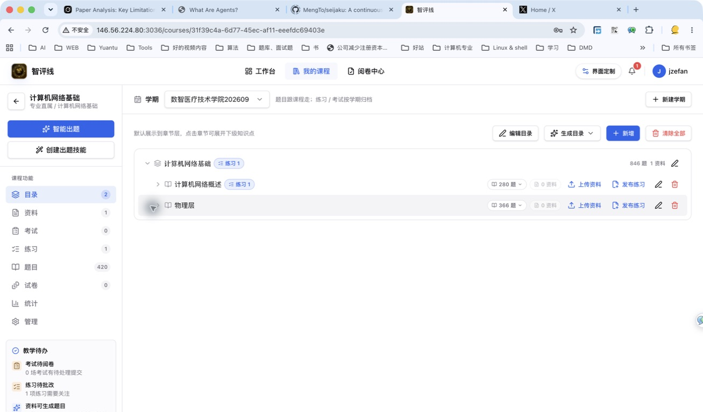
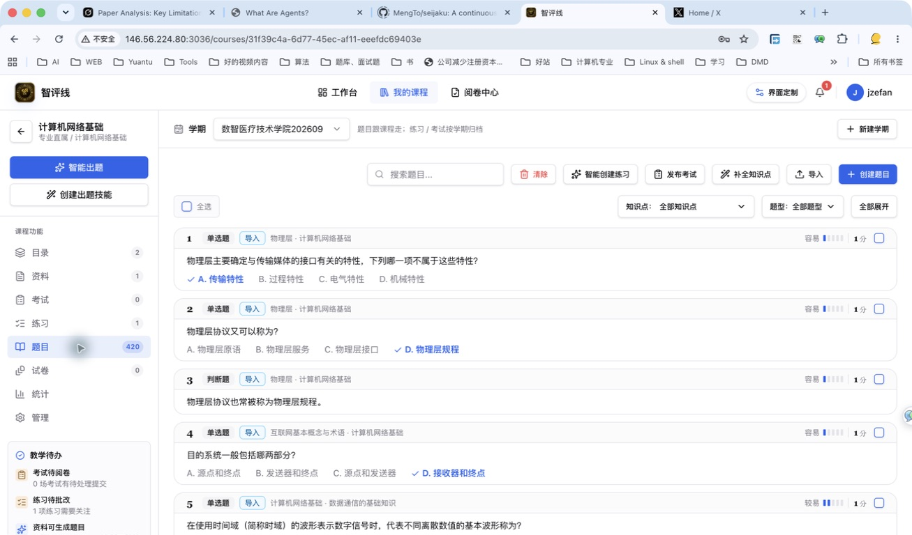
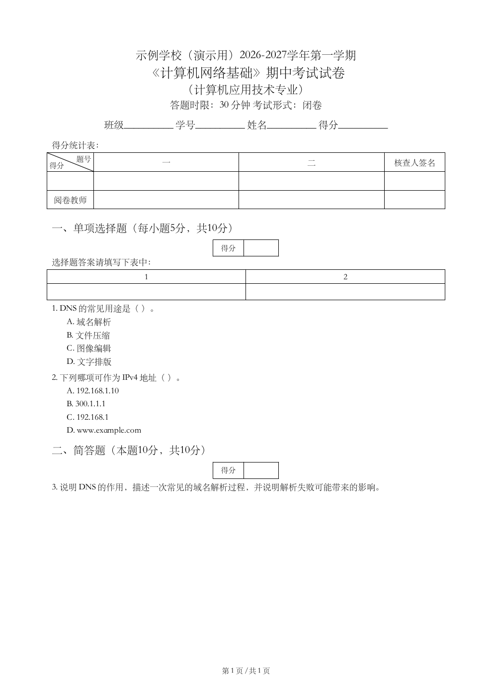
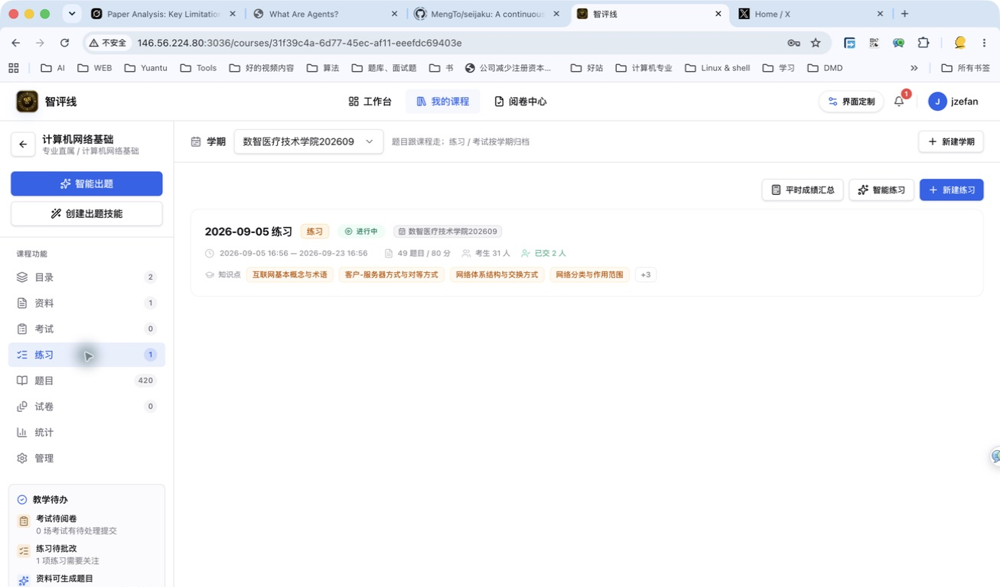
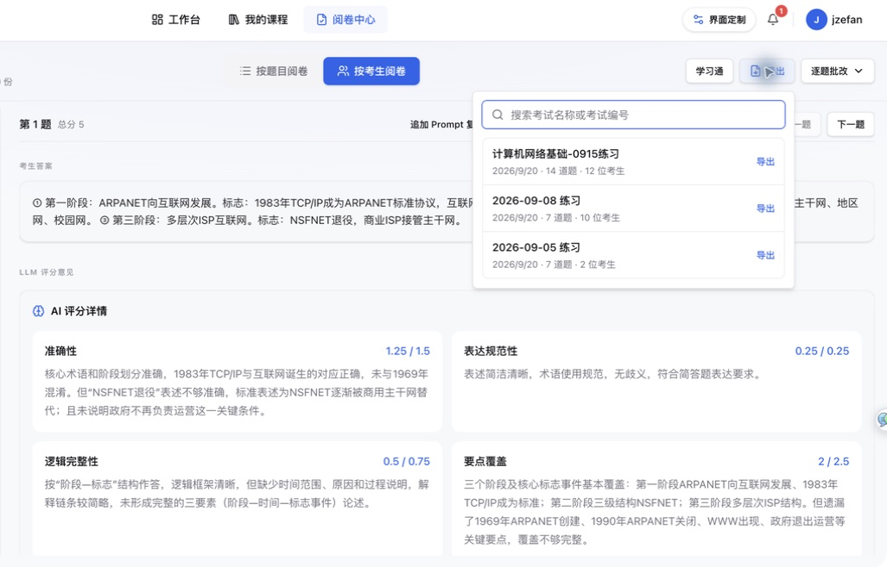
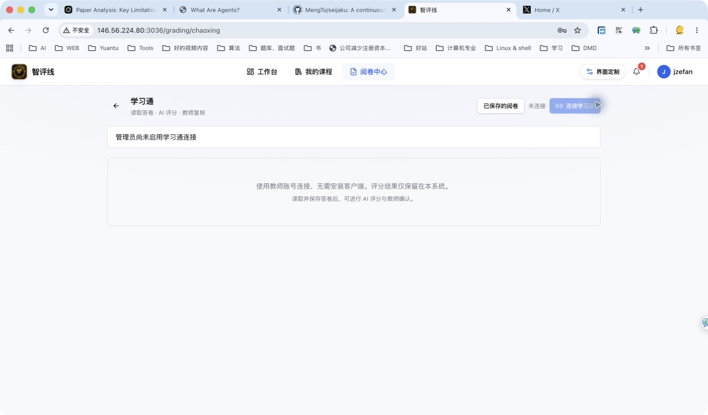

  
智评线 · 产品介绍

  <h1>让课程、题目、考试和评价 连在一起</h1>
  
智能出题，灵活出卷，AI 辅助批阅。

  

    依据资料智能出题
    主观题 AI 评分
    标准试卷输出
  

产品介绍 · 概览

01 / 17

<!--
各位老师好，今天向大家介绍智评线系统的主要使用流程。
日常教学中，教学资料、历年题目和往期试卷往往分散在不同电脑和文件夹中，出卷、批改和统计比较费时间。
智评线把这些环节整合到一门课程里：老师整理好的题目和试卷可以跨学期留存，组织考试和练习时 AI 会给出批阅建议和扣分依据，最后由老师审核确认。
整场介绍约 15 分钟，随后进入现场真机演示。
-->

---

使用背景

<h1>一次考试，老师常要在几个地方来回切换</h1>

  

    <b>旧题需要更新，新题编写费时</b>
    
已有题目反复使用后需要更新；从讲义重新整理题干、参考答案和解析，往往要花不少时间。

  

  

    <b>手工组卷排版费时费力</b>
    
每次组卷都要从多份旧文档中反复复制、粘贴、对答案并调整格式，极易错漏。

  

  

    <b>主观题批改花时间</b>
    
大班教学中，几十上百份问答题批改工作量大，常常只能打个分数，很难逐份写详细评语。

  

  

    <b>考完往往只有总分</b>
    
平时导出的成绩单只有总分，具体到哪个知识点学生普遍没弄懂，缺少直观的数据统计。

  

  

    <b>智评线的做法</b>
    
以课程为中心，把知识目录、题库建设、试卷管理、考试与练习、智能批阅和学情分析，连成一条完整流程。

  

背景与定位

02 / 17

<!--
这四个问题是很多老师组织考试时的常见困扰：
旧题需要更新，编写新题费时，组卷排版费时，主观题批改工作量大，最后给到学生的往往只有一个总分。
智评线专注于把题库、试卷、考试、批阅和成绩分析连起来，让题目能长期复用，批阅有据可依。
-->

---

完整流程

<h1>一门课程的使用流程</h1>

  <svg viewBox="0 0 960 320" fill="none" xmlns="http://www.w3.org/2000/svg">
    <g transform="translate(10, 20)">
      <rect width="210" height="270" rx="6" fill="#FAF9F5" stroke="#E8E6DC" stroke-width="1.2"/>
      <rect x="16" y="16" width="64" height="24" rx="3" fill="#E4ECF5"/>
      <text x="48" y="32" fill="#1B365D" font-size="11" font-weight="700" text-anchor="middle">步骤一</text>
      <text x="16" y="70" fill="#141413" font-size="16" font-weight="600">课程与知识树</text>
      <text x="16" y="100" fill="#504E49" font-size="12.5">• 创建课程，关联学期和班级</text>
      <text x="16" y="126" fill="#504E49" font-size="12.5">• 搜书名或拍照获取目录</text>
      <text x="16" y="152" fill="#504E49" font-size="12.5">• 模板文件批量导入</text>
      <text x="16" y="178" fill="#504E49" font-size="12.5">• 提取资料知识点，核对后入树</text>
      <rect x="16" y="215" width="178" height="38" rx="4" fill="#EEF2F7"/>
      <text x="105" y="238" fill="#1B365D" font-size="11.5" font-weight="600" text-anchor="middle">快速建立清晰章节知识结构</text>
    </g>
    <path d="M232 155 H254" stroke="#1B365D" stroke-width="2" stroke-linecap="round"/>
    <polygon points="252,150 260,155 252,160" fill="#1B365D"/>
    <g transform="translate(265, 20)">
      <rect width="205" height="270" rx="6" fill="#FAF9F5" stroke="#E8E6DC" stroke-width="1.2"/>
      <rect x="16" y="16" width="64" height="24" rx="3" fill="#E4ECF5"/>
      <text x="48" y="32" fill="#1B365D" font-size="11" font-weight="700" text-anchor="middle">步骤二</text>
      <text x="16" y="70" fill="#141413" font-size="16" font-weight="600">题库与试卷建设</text>
      <text x="16" y="100" fill="#504E49" font-size="12.5">• 题库分类录入与管理</text>
      <text x="16" y="126" fill="#504E49" font-size="12.5">• AI 依课程资料出新题</text>
      <text x="16" y="152" fill="#504E49" font-size="12.5">• 历史整份试卷智能拆解</text>
      <text x="16" y="178" fill="#504E49" font-size="12.5">• 组卷并输出 Word / PDF</text>
      <rect x="16" y="215" width="173" height="38" rx="4" fill="#EEF2F7"/>
      <text x="102" y="238" fill="#1B365D" font-size="11.5" font-weight="600" text-anchor="middle">题目长期留存，换学期复用</text>
    </g>
    <path d="M482 155 H504" stroke="#1B365D" stroke-width="2" stroke-linecap="round"/>
    <polygon points="502,150 510,155 502,160" fill="#1B365D"/>
    <g transform="translate(515, 20)">
      <rect width="210" height="270" rx="6" fill="#FAF9F5" stroke="#E8E6DC" stroke-width="1.2"/>
      <rect x="16" y="16" width="64" height="24" rx="3" fill="#E4ECF5"/>
      <text x="48" y="32" fill="#1B365D" font-size="11" font-weight="700" text-anchor="middle">步骤三</text>
      <text x="16" y="70" fill="#141413" font-size="16" font-weight="600">组织考试与练习</text>
      <text x="16" y="100" fill="#504E49" font-size="12.5">• 关联当前学期授课班级</text>
      <text x="16" y="126" fill="#504E49" font-size="12.5">• 平时练习（交卷即看解析）</text>
      <text x="16" y="152" fill="#504E49" font-size="12.5">• 正式考试（限时与切屏控制）</text>
      <text x="16" y="178" fill="#504E49" font-size="12.5">• 学生端手机电脑灵活作答</text>
      <rect x="16" y="215" width="178" height="38" rx="4" fill="#EEF2F7"/>
      <text x="105" y="238" fill="#1B365D" font-size="11.5" font-weight="600" text-anchor="middle">按班级一键精准发布</text>
    </g>
    <path d="M737 155 H759" stroke="#1B365D" stroke-width="2" stroke-linecap="round"/>
    <polygon points="757,150 765,155 757,160" fill="#1B365D"/>
    <g transform="translate(770, 20)">
      <rect width="180" height="270" rx="6" fill="#FFFFFF" stroke="#1B365D" stroke-width="1.6"/>
      <rect x="16" y="16" width="76" height="24" rx="3" fill="#1B365D"/>
      <text x="54" y="32" fill="#FFFFFF" font-size="11" font-weight="700" text-anchor="middle">步骤四</text>
      <text x="16" y="70" fill="#141413" font-size="16" font-weight="600">智能批阅与分析</text>
      <text x="16" y="100" fill="#504E49" font-size="12.5">• 客观题系统自动判分</text>
      <text x="16" y="126" fill="#504E49" font-size="12.5">• 主观题 AI 多维评分依据</text>
      <text x="16" y="178" fill="#1B365D" font-size="12.5" font-weight="600">• 老师最终审核与改分</text>
      <text x="16" y="152" fill="#504E49" font-size="12.5">• 知识点正答率透视与导出</text>
      <rect x="16" y="215" width="148" height="38" rx="4" fill="#E4ECF5"/>
      <text x="90" y="238" fill="#1B365D" font-size="11.5" font-weight="700" text-anchor="middle">老师把关 · 数据留存</text>
    </g>
  </svg>

整体流程

03 / 17

<!--
这张图概括了系统的基本运转流程。
第一步，创建课程并关联学期和班级，再通过搜书名、拍照或资料提取建立课程目录和知识点；
第二步，利用题库管理和试卷管理，充实题目并组织试卷；
第三步，按班级组织考试或平时练习，学生可通过电脑或手机便捷作答；
第四步，客观题自动判分，主观题 AI 给出扣分依据与评语草稿，老师复核确认并导出学情报告。
下面我们逐一展开。
-->

---

课程与目录

<h1>课程一次建好，资料和题目跨学期复用</h1>

  

    
课程是存放资料、题目、试卷和考试的地方。新学期直接关联新班级，不用从头再建。

    

      

        1
        

          <b>按教材章节建目录</b>
          老师可以根据教材章节建目录树，把参考资料和题目分别归入对应节点。
        

      

      

        2
        

          <b>学期和班级独立关联</b>
          同一门课可以挂接不同学期的班级，课程里的资料和题目长期保留。
        

      

      

        3
        

          <b>课程首页总览</b>
          首页能看到已上传的资料数、题目数、考试与练习场次以及学生参与情况。
        

      

    

    

      <b>课程示例</b>
      
《计算机网络基础》按章节整理资料、题目和教学活动。

    

  

  

    

      

      课程知识目录与学期管理
    

    

      
    

  

课程与目录

04 / 17

<!--
创建课程是整个流程的基础。
课程建好后，章节目录、参考资料和题目都会留在这门课里。
新学期开课时，只要在管理页面里添加当前学期、勾选授课班级，过去积累的题库和试卷就能直接使用，不用重新搬运。
截图来自线上真实环境，示例课程是《计算机网络基础》。
-->

---

知识树生成与提取

<h1>教材目录和教学资料，都能用来建知识树</h1>

  

    
按手头已有的材料选择方式，核对后形成课程知识树。

    

      

        1
        

          <b>搜书名由 AI 生成目录</b>
          按书名查找目录。若由 AI 推断生成，需对照教材确认。
        

      

      

        2
        

          <b>拍照或截图识别目录</b>
          直接上传教材目录页照片或扫描件，系统通过 OCR 识别提取各级章节。
        

      

      

        3
        

          <b>模板文件批量导入</b>
          支持标准 Markdown 或文本模板文件，已有目录大纲一键导入建树。
        

      

    

    

      <b>核心亮点 · 从上传资料中提取知识点</b>
      
AI 从讲义等资料中提取候选知识点，老师核对后加入课程目录，后续出题可关联这些知识点。

    

  

  

    

      

      智能目录生成与知识点识别
    

    

      
    

  

知识树生成

05 / 17

<!--
很多老师在搭建新课时，最怕手动敲几十个章节目录。
智评线提供了非常灵活的建树工具：
您可以直接输入教材名字让 AI 搜索生成目录，也可以用手机拍一张课本目录页传上来自动识别，或者从现有的文档大纲导入。
上传教学讲义后，还可以让 AI 提取候选知识点，老师核对后再加入目录，后续出题和学情分析就有了对应的知识点。
-->

---

题库与试卷

<h1>题目逐道积累，试卷整份复用</h1>

  

    
题目与试卷各有专属管理工作台，既能单题积累，也能整份卷面归档。

    

      

        <b style="margin: 0; font-size: 15px;">专门题库（题目管理）</b>
        单题入库
      

      
按知识点分类管理单选、多选、判断、填空、问答题。支持手动录入、批量导入，亦可选择知识点，让 AI 依据上传的课程资料定向出新题，老师核对入库。

    

    

      

        <b style="margin: 0; font-size: 15px;">试卷管理（试卷资产）</b>
        整卷导入 · 灵活组卷
      

      
上传既有的完整 Word / PDF / Markdown 试卷，系统自动解析题干、选项、答案与分值切分入卷；亦可随时从题库中挑选题目快速组装成新试卷。

    

  

  

    

      

      课程题库
    

    

      
    

  

题库与试卷

06 / 17

<!--
系统里把“题目”和“试卷”清晰分工：
在题库模块，题目像积木一样按知识点归类，支持单题新建，也支持由 AI 依据课程材料出新题；
在试卷管理模块，老师可以直接上传历年整份 Word 或 PDF 期末考卷，系统自动切成题并保持试卷结构，组卷时直接复用。
不管是出新题还是导旧卷，老师都享有最终审核权。
-->

---

产品亮点 · 从资料中智能生成题目

<h1>老师自己的讲义，可以成为出题依据</h1>

  

    
选一份课程资料，指定知识点、题型、数量和难度，AI 据此生成题目。

    <ol class="feature-steps">
      <li><b>带入资料内容</b>系统读取正文，支持时结合资料中的图片信息。</li>
      <li><b>说明这次怎么考</b>例如“围绕域名解析，侧重过程理解，生成 2 道简答题”。</li>
      <li><b>核对后留下可用题目</b>检查题干、答案和解析，选中的题目关联当前知识点并存入课程题库。</li>
    </ol>
  

  

    
教学示例 · 非线上生成记录

    <h2>《计算机网络基础》讲义</h2>
    
<b>资料内容：</b>DNS 的作用、缓存与查询过程、解析失败的影响。

    

    
<b>可形成的简答题</b>

    
说明 DNS 的作用，描述一次常见的域名解析过程，并说明解析失败可能带来的影响。

    
老师重点核对：题目是否在本次教学范围内，参考答案是否准确。

  

资料出题

07 / 17

<!--
这里真正方便老师的，是把自己的教学资料带进出题过程。
例如本周讲 DNS，可以选这一节的讲义，要求 AI 出两道侧重过程理解的简答题，再核对它是否超出教学范围。
右侧是为讲解准备的教学示例，不是线上模型生成记录。系统实际生成时还会提供参考答案和解析，老师可以编辑并选择保存。
保存后题目进入课程题库并关联知识点，下次组卷、布置练习可以继续使用。
-->

---

产品亮点 · 输出标准试卷

<h1>组好的题目，可以直接输出成 Word 或 PDF 试卷</h1>

  

    
同一份试卷既可用于线上考试，也可导出后打印、修改或归档。

    <ol class="feature-steps">
      <li><b>卷面按模板排好</b>包含卷头、学生信息栏、得分统计表、题型分区和分值。</li>
      <li><b>空白版发给学生</b>主观题预留答题空间，PDF 便于打印。</li>
      <li><b>含答案版供老师使用</b>保留参考答案，Word 可继续编辑，适合备课与归档。</li>
    </ol>
    
“标准”指系统现有卷面模板。学校有专用格式时，可在 Word 中调整。

  

  <figure class="paper-preview">
    
    <figcaption>现有导出器输出的示例卷 · 使用演示题目</figcaption>
  </figure>

标准试卷输出

08 / 17

<!--
有些老师即使暂时不组织线上考试，也可以先用资料出题、题库组卷和试卷导出。
右侧是当前系统导出器生成的空白示例卷，使用演示题目，不含真实学生数据。
卷头、题型分区、得分表和主观题答题空间都由模板排好。空白版可以给学生用，含答案版供教师参考。
系统支持 Word 和 PDF 两种格式。若学校规定了另一种专用版式，导出 Word 后可以继续调整，不能把系统模板说成符合所有学校的格式。
现场可以打开 examples/standard-paper-blank.pdf，再打开 standard-paper-answers.pdf 对照。
-->

---

考试与练习

<h1>同一批题目，可用于练习和正式考试</h1>

  

    
题目入库后，老师可以在不同场景下随时调取组卷并发布。

    

      

        1
        

          <b>按班级选择学生</b>
          直接勾选当前学期的授课班级，也可以指定部分学生参与。
        

      

      

        2
        

          <b>平时练习（巩固自测）</b>
          题量小（如 5~10 题），学生交卷后可立刻查看客观题答案与解析。
        

      

      

        3
        

          <b>正式考试（严格考核）</b>
          设置统一开放时间、截止时间、答题时长与切屏限制，用于期中或期末考核。
        

      

    

    

      <b>进度一目了然</b>
      
列表直接展示应考人数、已交人数、平均分以及覆盖的知识点。

    

  

  

    

      

      课程练习与考试管理
    

    

      
    

  

考试与练习

09 / 17

<!--
在发布时，因为课程已经关联了班级，老师不用每次重新导名单。
平时上完课，可以挑 5 道题发一次练习；到了期末，也可以按题型和分值组一套正式考试。
列表里能直接看到每个班有多少人交了卷、平均分是多少。
-->

---

产品亮点 · 主观题 AI 评分

<h1>主观题逐项评分，老师能查看给分依据</h1>

  <svg viewBox="0 0 960 300" fill="none" xmlns="http://www.w3.org/2000/svg">
    <g transform="translate(20, 20)">
      <rect width="420" height="260" rx="6" fill="#FAF9F5" stroke="#E8E6DC" stroke-width="1.2"/>
      <rect x="20" y="16" width="110" height="24" rx="3" fill="#E4ECF5"/>
      <text x="75" y="32" fill="#1B365D" font-size="12" font-weight="700" text-anchor="middle">AI 辅助评分</text>
      <g transform="translate(20, 60)">
        <circle cx="10" cy="10" r="4" fill="#1B365D"/>
        <text x="24" y="14" fill="#141413" font-size="14" font-weight="600">带着本题的评分标准评价</text>
        <text x="24" y="34" fill="#504E49" font-size="12">结合题干、参考答案、各项分值和学生作答。</text>
      </g>
      <g transform="translate(20, 115)">
        <circle cx="10" cy="10" r="4" fill="#1B365D"/>
        <text x="24" y="14" fill="#141413" font-size="14" font-weight="600">主观题列出给分依据</text>
        <text x="24" y="34" fill="#504E49" font-size="12">检查答出的要点与遗漏，认可意思相同的表述。</text>
      </g>
      <g transform="translate(20, 170)">
        <circle cx="10" cy="10" r="4" fill="#1B365D"/>
        <text x="24" y="14" fill="#141413" font-size="14" font-weight="600">生成学生改进建议</text>
        <text x="24" y="34" fill="#504E49" font-size="12">指出作答优点与遗漏，拟好供老师参考的评语草稿。</text>
      </g>
    </g>
    <g transform="translate(450, 110)">
      <rect x="0" y="10" width="60" height="60" rx="30" fill="#1B365D"/>
      <path d="M22 40 L38 40 M30 32 L38 40 L30 48" stroke="#FFFFFF" stroke-width="2.5" stroke-linecap="round" stroke-linejoin="round"/>
      <text x="30" y="88" fill="#1B365D" font-size="11" font-weight="700" text-anchor="middle">供老师核验</text>
    </g>
    <g transform="translate(520, 20)">
      <rect width="420" height="260" rx="6" fill="#FFFFFF" stroke="#1B365D" stroke-width="1.6"/>
      <rect x="20" y="16" width="116" height="24" rx="3" fill="#1B365D"/>
      <text x="78" y="32" fill="#FFFFFF" font-size="12" font-weight="700" text-anchor="middle">老师把关 · 最终确认</text>
      <g transform="translate(20, 60)">
        <circle cx="10" cy="10" r="4" fill="#1B365D"/>
        <text x="24" y="14" fill="#141413" font-size="14" font-weight="600">确认或修改分数</text>
        <text x="24" y="34" fill="#504E49" font-size="12">认可初评建议可直接采纳，也可以根据实际情况随时改分。</text>
      </g>
      <g transform="translate(20, 115)">
        <circle cx="10" cy="10" r="4" fill="#1B365D"/>
        <text x="24" y="14" fill="#141413" font-size="14" font-weight="600">补充老师的考试评价</text>
        <text x="24" y="34" fill="#504E49" font-size="12">结合整份答卷，添加或编辑对该生本次考试的整体评价。</text>
      </g>
      <g transform="translate(20, 170)">
        <circle cx="10" cy="10" r="4" fill="#1B365D"/>
        <text x="24" y="14" fill="#141413" font-size="14" font-weight="600">支持补充要求后复评</text>
        <text x="24" y="34" fill="#504E49" font-size="12">可追问“这处表达是否同义”，让 AI 按原标准复评。</text>
      </g>
    </g>
  </svg>

智能阅卷

10 / 17

<!--
这一页说明 AI 在阅卷中承担什么角色。
AI 结合题目、参考答案和评分细则逐项评价，说明学生答对了什么、缺少什么，并给出学习建议。
老师可以确认采纳，也可以改分并留下说明。遇到有争议的表述，还可以追问，让 AI 在原评分标准下复评。
系统也支持主评、复核及按配置启用的仲裁流程。它们提供复核线索，老师仍需检查具体依据。
-->

---

批阅工作台

<h1>一份答卷里的分数、依据和改进建议</h1>

  

    
真实阅卷界面中，学生作答、参考依据与评分细则并列呈现。

    

      

        1
        

          <b>按维度列出依据</b>
          考点准确性、要点完整性、逻辑等维度均列有具体得分和扣分说明。
        

      

      

        2
        

          <b>给学生的改进建议</b>
          指出作答优点，具体说明哪一点表述不准确、如何补充，便于学生订正。
        

      

      

        3
        

          <b>继续追问评分依据</b>
          对有争议的要点补充提问，查看解释后再判断是否需要改分。
        

      

    

  

  

    

      

      智能阅卷详情工作台
    

    

      
    

  

智能阅卷

11 / 17

<!--
右侧是主观题批阅的实际界面。
以往手工批改，几十份卷子很难逐个写评语，学生拿回去往往只看到一个分数。
在智评线里，AI 会对照标准答案把要点逐条列出，比如指出“第 1 点已答出，第 2 点缺少关键协议描述”。
学生看到这段评语能知道问题出在哪里，老师复核时也省去了大量反复敲字的时间。
-->

---

系统真实提示词

<h1>主观题评分：系统实际发送给模型的提示词</h1>

  

    
系统提示词 · _build_grading_system_prompt

    
你是高职高校课程评分专家，同时担任本次评阅流程中的评分模型。 你拥有 10 年以上高职院校教学经验，熟悉高职学生的认知特点、学习难点、课程评估、题库建设、SQL 与编程练习评分。 你的评分风格必须严谨、客观、公正、可解释，并具备教学指导性。 必须使用简体中文回复所有评分意见、复评解释、扣分原因和改进建议。 你需要严格依据给定 Rubric、评分维度、分值权重和题目上下文，对当前学生答案进行逐项评分。 本题 max_score 为 &#123;task.max_score&#125;。  以下是必须遵守的通用评分规范，请严格执行： 1. 严格依据 Rubric，不得自行增加、减少或替换评分维度。 4. 允许语义等价、功能等价、逻辑等价的多种正确实现方式得分。 5. 严禁编造学生未写出的内容。 8. 必须明确指出扣分原因、错误知识点和可执行的学习建议。

  

  

    
用户提示词 · _build_prompt_pair

    
Task ID: &#123;task.id&#125; Question type: &#123;task.question_type&#125; Question: &#123;task.question_content&#125; Max score: &#123;task.max_score&#125; Preferred locale: &#123;preferred_locale&#125; Knowledge tags: &#123;json.dumps(task.knowledge_tags, ensure_ascii=False)&#125; Context: &#123;json.dumps(context, ensure_ascii=False, sort_keys=True)&#125;  Context（简答题）包含： question、student_answer、standard_answers、analysis、 rubric_definition，以及 evidence 中的 knowledge_points、dimension_weights、deduction_rules、fatal_error_rules。

  

以上为当前代码实际拼接的原文节选；动态字段在每道题、每位学生评分时替换。完整通用规则和简答题规则见 examples/subjective-grading-prompt.md。

主观题评分提示词

12 / 17

<!--
这一页直接展示系统评分服务的真实提示词结构，不再使用 DNS 评分的虚构示例。
系统提示词由 service.py 的 _build_grading_system_prompt 组装：角色、语言、评分模式、满分、通用规则和题型专项规则会拼在一起。
用户提示词由 _build_prompt_pair 组装：Task ID、题目、满分、语言、知识标签和 Context 会随当前评分任务注入。
简答题 Context 由 _build_grading_context 和 build_short_answer_rubric_context 生成，包含学生作答、参考答案、评分细则和扣分规则。
页面只放可读的原文节选，完整文本与源码路径放在 examples/subjective-grading-prompt.md。实际模型还必须返回 common-base.md 规定的结构化 JSON 字段。
-->

---

成绩与分析

<h1>成绩与逐题明细，帮助老师安排考后讲评</h1>

  

    
不仅能导出成绩单，还能看学生在哪些题目和知识点上容易丢分。

    

      

        1
        

          <b>导出完整数据</b>
          支持按场次导出学生成绩表、逐题得分明细以及批阅记录，方便教学归档。
        

      

      

        2
        

          <b>查看知识点正答率</b>
          汇总各章节题目的正确率，看清班级整体在哪些知识点上存在盲区。
        

      

      

        3
        

          <b>讲评答疑有的放矢</b>
          根据统计集中的错题，在考后讲评时重点剖析，不用全卷平均使力。
        

      

    

    

      <b>保留复核记录</b>
      
系统记录 AI 初始建议、老师修改记录和最终确认人，过程有据可查。

    

  

  

    

      

      成绩与学情分析导出
    

    

      
    

  

成绩与分析

13 / 17

<!--
考完试后，系统不仅能导出一张总分 Excel 表，还能看到班级在各个知识点上的得分分布。
比如老师一眼能看到班级在某道综合应用题上的失分率达到 60%，那考后讲评时就能专门花 15 分钟把这个题型讲透，
不用再凭感觉去猜学生到底哪里没掌握。
-->

---

学生端体验

<h1>学生用手机或电脑答题，查看反馈并复习错题</h1>

  

    
学生使用极简：无需下载 App，扫码或浏览器即可随时作答、查看评语与巩固错题。

    

      

        1
        

          <b>考试与练习列表</b>
          待考、进行中、已交卷分类呈现，截止时间与考试状态清晰明确。
        

      

      

        2
        

          <b>多端自适应做题作答</b>
          手机与电脑免装 App 浏览器即答，单选/多选/填空/主观问答，答案实时自动保存。
        

      

      

        3
        

          <b>查看结果与多维评语</b>
          成绩与解析开放后，可查看逐题得分、扣分依据与改进建议。
        

      

      

        4
        

          <b>专属智能错题本</b>
          历次练习与考试的错题自动归集，支持按知识点筛选并一键生成针对性巩固练习。
        

      

    

  

  

    

      

      智评线 · 学生端工作台与考试列表
    

    

      
    

  

学生端体验

14 / 17

<!--
对学生来说，系统使用门槛非常低。
大家看右侧真实的学生端工作台：学生登录后，可以直观看到待参加的考试与练习、已评分的答卷，以及平均分统计；
不用强迫学生下载独立 App，学生用手机或电脑直接登录就能答题。
成绩与解析开放后，学生能查看各题扣分依据和改进建议；
系统右侧还自带错题回顾入口，帮学生把平时的错题集中起来，学生自己就能针对薄弱点再次复习。
-->

---

连接学习通

<h1>学习通的考试答卷，也可接入主观题评价</h1>

  

    
学校如果已经在用学习通，可以把那边的答卷同步过来进行批阅。

    

      

        1
        

          <b>通过教师账号授权</b>
          绑定教师账号后，可读取学习通里的课程和已提交的考试答卷。
        

      

      

        2
        

          <b>同步答卷进行批阅</b>
          老师核对后把答卷保存到智评线，使用 AI 给出主观题批改依据。
        

      

      

        3
        

          <b>数据边界明确</b>
          评分结果保存在智评线，不回写覆盖学习通数据，也不自动建学生账号。
        

      

    

    

      <b>环境说明</b> 
      截图时尚未启用连接。使用前需由管理员完成配置，老师登录授权后读取答卷。
    

  

  

    

      

      第三方教学平台连接入口
    

    

      
    

  

平台连接

15 / 17

<!--
不少学校已经在用学习通组织考试。
如果学生习惯了在学习通答题，老师也可以直接把学习通上的答卷同步过来，利用智评线来辅助批改主观题。
评分结果存放在智评线这边，不会弄乱学习通原本的成绩。
当前截图展示的是连接入口，正式使用前需由管理员完成配置，再由教师登录授权。
-->

---

前后对比

<h1>老师的工作会有哪些变化</h1>

  

    原来（传统方式）
    

      

        <b>讲完一节课，再从头编题</b>
        对照讲义编写题干、参考答案和解析，再整理进题库。
      

      

        <b>手工组卷排版</b>
        每次组卷都要从各个文件反复复制粘贴排版，容易错漏。
      

      

        <b>耗时人工打分</b>
        大班主观题批改耗时长，难以为每位学生写具体改进建议。
      

      

        <b>考后缺少分析</b>
        成绩导出后只有总分，很难分析具体是哪个知识点没学懂。
      

    

  

  
→

  

    使用智评线
    

      

        <b>依据自己的资料出题</b>
        指定教学范围生成题目，核对后存入课程题库，跨学期复用。
      

      

        <b>输出排好版的试卷</b>
        组卷后导出 Word 或 PDF，可选空白版和含答案版。
      

      

        <b>人机协同批阅</b>
        AI 按本题标准逐项给分并解释原因，老师复核、追问或改分。
      

      

        <b>学情反馈讲评</b>
        逐题分析掌握情况，找出共性错题，直接用于考后讲评。
      

    

  

前后对比

16 / 17

<!--
资料出题、主观题评分和试卷输出，分别对应备课出题、批阅和组卷归档中的具体工作。
这些功能都围绕同一门课程：题目能继续复用，评分有具体依据，结果也能用于考后讲评。
-->

---

  
现场实操演示

  <h1 style="font-size: 34px; margin-bottom: 8px;">用一份资料、一道主观题和一份试卷体验系统</h1>
  

    课程和班级准备好后，先看三个能直接用在教学里的结果。
  

  

    

      <b style="color: var(--kami-ink-blue); font-size: 19px; margin-bottom: 12px;">1. 看资料怎样变成题目</b>
      
选一节课的讲义，指定知识点和题型，检查生成的题干、答案与解析。

    

    

      <b style="color: var(--kami-ink-blue); font-size: 19px; margin-bottom: 12px;">2. 看主观题为什么得这个分</b>
      
打开一份已完成的答卷，对照评分标准查看依据，演示老师复核与追问。

    

    

      <b style="color: var(--kami-ink-blue); font-size: 19px; margin-bottom: 12px;">3. 带走一份能用的试卷</b>
      
组卷后打开空白版和含答案版，查看 Word 与 PDF 的实际输出。

    

  

  
第一次试用，可以带一份自己的讲义或现有试卷，从熟悉的课程开始。

现场演示

17 / 17

<!--
现场围绕三个结果展开：从资料中出一道题，看一份主观题的评分依据，再打开一份标准试卷。
课程创建、学期与班级关联、目录整理已经在前面讲清楚，现场可用准备好的演示课程和答卷继续展示。
如果老师更关心现有试卷怎么用，可以接着演示导入 Word 或 PDF、核对题目和分值、关联班级并发布考试。
各位老师在演示过程中可以随时打断提问交流。
-->
